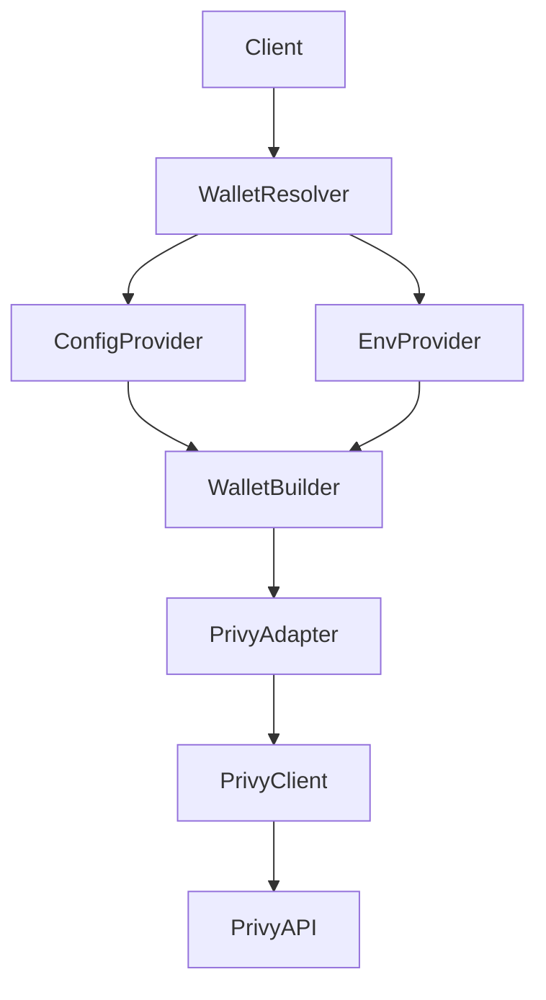
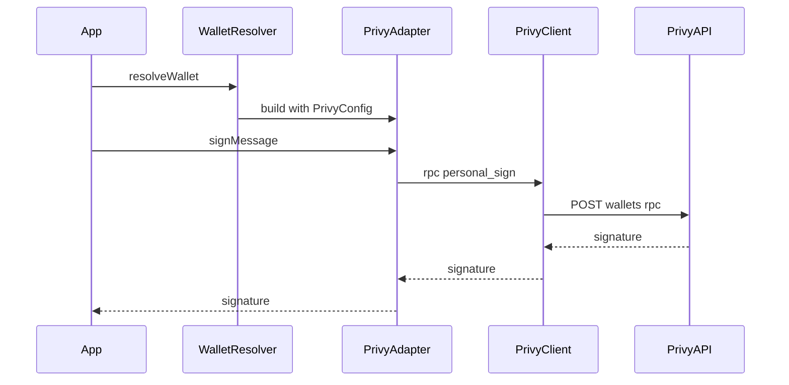

# Design Document

## Overview
This feature adds a Privy-based wallet adapter to agent-wallet and introduces a deterministic, source-isolated configuration resolution path that supports both config-provider and env-provider sources. The design preserves the existing adapter/provider model while enabling Privy signing and maintaining strict validation and observability requirements.

Target users are SDK integrators and operators who need to sign messages and transactions using Privy-hosted wallets. The change extends the wallet adapter set without altering core caller workflows (`resolveWallet`, `resolveWalletProvider`) and emphasizes safe handling of credentials.

### Goals
- Enable Privy adapter selection in both TypeScript and Python SDKs.
- Support config-provider and env-provider configuration sources with explicit source isolation.
- Map agent-wallet signing methods to Privy RPC endpoints with explicit error handling.
- Preserve existing adapter/provider behaviors for non-Privy wallets.

### Non-Goals
- Privy wallet creation, policy management, or user management.
- Chain-gating logic based on network strings.
- UI or CLI changes beyond necessary configuration support.

## Architecture

### Existing Architecture Analysis (if applicable)
- Current adapters include `local_secure`, `raw_secret`, and network-specific EVM/TRON signers.
- Provider resolution prefers config-backed providers, then falls back to env-backed providers.
- Each provider reads only its own data source (config file vs env vars).
- Wallet configuration is persisted in `wallets_config.json` with shared schemas between TypeScript and Python.

### Architecture Pattern & Boundary Map
**Architecture Integration**:
- Selected pattern: Hexagonal (ports & adapters) with a dedicated Privy adapter.
- Domain/feature boundaries: Configuration resolution (providers) is separated from signing behavior (adapters) and HTTP transport (client).
- Existing patterns preserved: `Wallet` interface, provider resolution order, config schema parity between TypeScript and Python.
- New components rationale: Privy adapter encapsulates RPC mapping; Privy client centralizes auth headers and retries; Privy config resolver normalizes a single source (config or env).
- Steering compliance: Aligns with product/tech/structure guidance (provider separation, signing-only scope, cross-language parity).



### Technology Stack

| Layer | Choice / Version | Role in Feature | Notes |
|-------|------------------|-----------------|-------|
| Backend / Services | Node 18+ fetch | Privy HTTP calls in TypeScript SDK | No new dependency |
| Backend / Services | Python 3.11 stdlib HTTPS client | Privy HTTP calls in Python SDK | Avoid new dependency unless required |
| Infrastructure / Runtime | HTTPS (TLS) | Secure Privy API transport | Required by Privy |

## CLI Support

The CLI will support creating and inspecting `privy` wallet entries in `wallets_config.json` while preserving existing flows. The CLI will not enforce `--network` for sign commands; parameter validation and unsupported behavior remain the adapter's responsibility.

**Privy CLI behavior**:
- Privy wallets are created from explicit `app_id`, `app_secret`, and **Privy wallet ID** values.
- The CLI offers a reuse flow to copy an existing Privy wallet entry **so users do not re-enter `app_id` / `app_secret`**.
  - In reuse mode, users only supply a new **Privy wallet ID**; the app ID/secret are reused from the selected entry.
- The CLI does not provide runtime override flags for Privy wallet selection.

**Start/Add interaction details (Privy)**:
- `start privy`:
  - If existing Privy wallets are present, prompt: **Reuse existing Privy app credentials?**
    - Selecting an existing entry reuses its `app_id`/`app_secret` and asks only for a **Privy wallet ID**.
    - Selecting “enter new credentials” asks for `app_id`, `app_secret`, then **Privy wallet ID**.
  - Create wallet entry and set active.
- `add privy`:
  - Same reuse flow as `start`, but does not auto-create runtime secrets.
  - The new entry can reuse `app_id`/`app_secret` while supplying a distinct **Privy wallet ID**.

## System Flows



## Requirements Traceability

| Requirement | Summary | Components | Interfaces | Flows |
|-------------|---------|------------|------------|-------|
| 1.1 | Register Privy adapter as available provider | WalletBuilder, ConfigSchema | WalletConfig, createAdapter | Resolver flow |
| 1.2 | Initialize adapter with resolved config | PrivyConfigResolver, PrivyAdapter | PrivyConfigResolver, PrivyAdapter | Resolver flow |
| 1.3 | Report initialization failure | PrivyConfigResolver, PrivyAdapter | PrivyErrorEnvelope | Resolver flow |
| 1.4 | Verifiable enable status | PrivyConfigResolver | PrivyConfigResolver | Resolver flow |
| 2.1 | Config provider source | PrivyConfigResolver | PrivyConfig | Resolver flow |
| 2.2 | Env provider source | PrivyConfigResolver | PrivyEnvConfig | Resolver flow |
| 2.3 | Deterministic provider order | PrivyConfigResolver | PrivyConfigResolver | Resolver flow |
| 2.4 | Missing required keys | PrivyConfigResolver | PrivyConfigError | Resolver flow |
| 3.1 | Minimal config keys | PrivyConfigResolver | PrivyConfig | Resolver flow |
| 3.2 | Validate required keys | PrivyConfigResolver | PrivyConfigError | Resolver flow |
| 3.3 | Report invalid format | PrivyConfigResolver | PrivyConfigError | Resolver flow |
| 4.1 | Track enable status | PrivyConfigResolver, PrivyAdapter | Status signals | Resolver flow |
| 4.2 | Record failure reasons | PrivyClient, PrivyAdapter | Error mapping | Resolver flow |
| 4.3 | Redact sensitive data | PrivyClient, Logging | Redaction policy | Resolver flow |

## Components and Interfaces

| Component | Domain/Layer | Intent | Req Coverage | Key Dependencies (P0/P1) | Contracts |
|-----------|--------------|--------|--------------|--------------------------|-----------|
| PrivyConfigResolver | Core config | Resolve and validate Privy configuration for a single source | 1.2, 1.3, 1.4, 2.1-2.4, 3.1-3.3, 4.1 | EnvProvider (P0), ConfigProvider (P0) | Service, State |
| PrivyAdapter | Adapter | Implement Wallet interface via Privy RPC | 1.1, 1.2, 1.3, 4.1-4.3 | PrivyClient (P0) | Service |
| PrivyClient | Integration | Encapsulate Privy HTTP auth, requests, retries | 4.2, 4.3 | Privy API (P0) | Service |
| Delivery CLI | Delivery | Collect Privy config inputs and write wallet config | 1.1, 2.1-2.4, 3.1-3.3 | ConfigProvider (P0) | State |

### Providers

#### Provider Source Model
- Provider axis = data source (WHERE).
- Wallet type = output (WHAT).
- Providers must only read their own source and never merge across sources.

#### ConfigWalletProvider (Privy)
**Intent**: Build Privy adapters using config-only inputs.

**Rules**
- Only read `wallets_config.json` for Privy params.
- Do not read env vars for Privy.

**Implementation (TypeScript)**
```typescript
// packages/typescript/src/core/providers/wallet-builder.ts
if (conf.type === WalletType.PRIVY) {
  const resolver = new PrivyConfigResolver({
    source: conf.params as PrivyWalletParams,
  })
  const resolved = resolver.resolve()
  const client = new PrivyClient({
    appId: resolved.appId,
    appSecret: resolved.appSecret,
  })
  return new PrivyAdapter(resolved, client)
}
```

#### EnvWalletProvider (Raw Secret only)
**Intent**: Build wallets using env-only inputs and keep a clean extension surface.

**Rules**
- Only read environment variables.
- If no env group is satisfied, return a provider-level "not enabled" signal.
- Require `network` when raw secret env is selected.

**Env groups**
- Raw secret:
  - `AGENT_WALLET_PRIVATE_KEY` OR `AGENT_WALLET_MNEMONIC`

**Implementation (TypeScript)**
```typescript
// packages/typescript/src/core/providers/env-provider.ts
function resolveEnvWallet(
  env: NodeJS.ProcessEnv,
  explicitNetwork: string | undefined,
  providerDefault: string | undefined,
): EnvWalletResolved | null {
  const raw = parseRawSecretEnv(env)
  if (raw) {
    return {
      params: raw,
      network: resolveNetwork(explicitNetwork, providerDefault),
    }
  }
  return null
}
```

#### Shared env constants & helpers
**Intent**: Centralize env keys and parsing helpers while avoiding import cycles.

**Rules**
- Define env key constants in `core/base` (single source of truth).
- Define parsing helpers (`firstEnv`, `cleanEnvValue`, account index parsing) in `core/utils/env` (or `core/utils`).
- `resolver` and `env-provider` may import these helpers; `wallet-builder` must not import them.
- `core/base` contains only interfaces/enums/types and env key constants (no IO).
- Avoid imports from adapters/clients inside env helpers to prevent cycles.

**Implementation (TypeScript)**
```typescript
// packages/typescript/src/core/base.ts
export const ENV_AGENT_WALLET_PASSWORD = 'AGENT_WALLET_PASSWORD'
export const ENV_AGENT_WALLET_DIR = 'AGENT_WALLET_DIR'
export const ENV_PRIVATE_KEY_KEYS = ['AGENT_WALLET_PRIVATE_KEY', 'TRON_PRIVATE_KEY'] as const
export const ENV_MNEMONIC_KEYS = ['AGENT_WALLET_MNEMONIC', 'TRON_MNEMONIC'] as const
export const ENV_ACCOUNT_INDEX_KEYS = [
  'AGENT_WALLET_MNEMONIC_ACCOUNT_INDEX',
  'TRON_ACCOUNT_INDEX',
] as const

// packages/typescript/src/core/utils/env.ts
export function cleanEnvValue(value: string | undefined): string | undefined {
  const trimmed = value?.trim()
  return trimmed || undefined
}

export function firstEnv(env: NodeJS.ProcessEnv, keys: readonly string[]): string | undefined {
  for (const key of keys) {
    const value = cleanEnvValue(env[key])
    if (value !== undefined) return value
  }
  return undefined
}

export function parseAccountIndex(value: string | undefined): number {
  const normalized = value?.trim()
  if (!normalized) return 0
  if (!/^\d+$/.test(normalized)) {
    throw new Error('AGENT_WALLET_MNEMONIC_ACCOUNT_INDEX must be a non-negative integer')
  }
  return Number(normalized)
}
```

#### Shared network + key helpers
**Intent**: Centralize small, dependency-light helpers reused by adapters and CLI to avoid drift.

**Rules**
- Put network family parsing in `core/utils/network`.
- Put key derivation helpers in `core/utils/keys`.
- `core/utils/*` must be pure (no IO, no config/env reads).
- Adapters and CLI may import these helpers; providers should avoid importing network/key helpers unless strictly needed.

**Targets**
- `parseNetworkFamily` / `parse_network_family`
  - Currently duplicated in adapters and CLI.
- `decodePrivateKey` / `decode_private_key`
  - Currently duplicated in adapters and CLI.
- `deriveKeyFromMnemonic` / `derive_key_from_mnemonic`
  - Currently duplicated in adapters and CLI.

**Implementation (TypeScript)**
```typescript
// packages/typescript/src/core/utils/network.ts
import { Network } from '../base.js'

export function parseNetworkFamily(network: string | undefined): Network {
  const normalized = network?.trim().toLowerCase()
  if (!normalized) throw new Error('network is required')
  if (normalized === 'tron' || normalized.startsWith('tron:')) return Network.TRON
  if (normalized === 'eip155' || normalized.startsWith('eip155:')) return Network.EVM
  throw new Error("network must start with 'tron' or 'eip155'")
}

// packages/typescript/src/core/utils/keys.ts
import { mnemonicToAccount } from 'viem/accounts'
import { Network } from '../base.js'

export function decodePrivateKey(privateKey: string): Uint8Array {
  const normalized = privateKey.trim().replace(/^0x/, '')
  if (normalized.length !== 64) {
    throw new Error('Private key must be 32 bytes (64 hex characters)')
  }
  if (!/^[0-9a-fA-F]+$/.test(normalized)) {
    throw new Error('Private key must be a valid hex string')
  }
  return Uint8Array.from(Buffer.from(normalized, 'hex'))
}

export function deriveKeyFromMnemonic(
  network: Network,
  mnemonic: string,
  accountIndex: number,
): Uint8Array {
  const path =
    network === Network.TRON
      ? (`m/44'/195'/0'/0/${accountIndex}` as `m/44'/60'/${string}`)
      : undefined

  const account = path
    ? mnemonicToAccount(mnemonic, { path })
    : mnemonicToAccount(mnemonic, { addressIndex: accountIndex })

  const privateKey = account.getHdKey().privateKey
  if (!privateKey) {
    throw new Error(`Failed to derive private key from mnemonic for ${network}`)
  }
  return privateKey
}
```

**Optional consolidation**
- `stripHexPrefix` helper can be moved to `core/utils/hex` if reused across adapters.

#### Env wallet kind
**Intent**: Reuse `WalletType` for env wallet kinds to align adapter selection across providers.

**Rule**
- Env provider only produces `WalletType.RAW_SECRET` (never `local_secure`).

### Wallet Builder Integration

#### Shared Builder Contract
**Intent**: Provide a single construction surface that providers can use, while keeping source-specific resolution outside of the builder.

**Rules**
- WalletBuilder must not read config files or environment variables directly.
- Providers pass in already-resolved params from their own source.

**Implementation (TypeScript)**
```typescript
// packages/typescript/src/core/providers/wallet-builder.ts
export function createAdapter(
  conf: WalletConfig,
  configDir: string,
  password: string | undefined,
  network: string | undefined,
  secretLoader: SecretLoaderFn | undefined,
): Wallet {
  if (conf.type === WalletType.LOCAL_SECURE) {
    return new LocalSecureSigner(
      conf.params as { secret_ref: string },
      configDir,
      password,
      network,
      secretLoader,
    )
  }
  if (conf.type === WalletType.RAW_SECRET) {
    return new RawSecretSigner(
      conf.params as RawSecretPrivateKeyParams | RawSecretMnemonicParams,
      network,
    )
  }
  if (conf.type === WalletType.PRIVY) {
    const resolver = new PrivyConfigResolver({
      source: conf.params as PrivyWalletParams,
    })
    const resolved = resolver.resolve()
    const client = new PrivyClient({
      appId: resolved.appId,
      appSecret: resolved.appSecret,
    })
    return new PrivyAdapter(resolved, client)
  }
  throw new Error(`Unknown wallet config type: ${conf.type}`)
}

export type EnvWalletResolved =
  | {
      params: RawSecretPrivateKeyParams | RawSecretMnemonicParams
      network: string | undefined
    }

export function createEnvAdapter(resolved: EnvWalletResolved): Wallet {
  return new RawSecretSigner(resolved.params, resolved.network)
}
```

#### Provider Resolution Flow
**Intent**: Keep provider selection order unchanged while delegating wallet construction to the shared builder.

**Implementation (TypeScript)**
```typescript
// packages/typescript/src/core/resolver.ts
export function resolveWalletProvider(options?: {
  network?: string
  dir?: string
}): ResolvedWalletProvider {
  const resolvedDir = resolveDir(options?.dir)
  const password = resolvePassword(resolvedDir)

  if (password) {
    return new ConfigWalletProvider(resolvedDir, password, {
      network: options?.network,
      secretLoader: loadLocalSecret,
    })
  }

  const config = loadConfigSafe(resolvedDir)
  if (hasAvailableConfigWallet(config)) {
    return new ConfigWalletProvider(resolvedDir, undefined, {
      network: options?.network,
      secretLoader: loadLocalSecret,
    })
  }

  return new EnvWalletProvider({
    network: options?.network,
  })
}

// packages/typescript/src/core/providers/env-provider.ts
export class EnvWalletProvider implements WalletProvider {
  async getActiveWallet(network?: string): Promise<Wallet> {
    const resolved = resolveEnvWallet(this._env, network, this._network)
    if (!resolved) {
      throw new Error('resolve_wallet could not find a wallet source in config or env')
    }
    return createEnvAdapter(resolved)
  }
}
```

#### End-to-End Data Flow (Concrete)
**Intent**: Show the exact path from `resolveWalletProvider()` to `EnvWalletProvider` to `WalletBuilder`.

**Step-by-step**
1) `resolveWalletProvider()` constructs providers and selects the first enabled source.
2) The selected provider resolves source-specific inputs (config file or env vars).
3) The provider calls `WalletBuilder` with fully-resolved params (no source IO inside builder).
4) `WalletBuilder` constructs the adapter and returns a `Wallet`.

**Implementation (TypeScript)**
```typescript
// packages/typescript/src/core/resolver.ts
export async function resolveWallet(options?: {
  network?: string
  dir?: string
  walletId?: string
}): Promise<Wallet> {
  const provider = resolveWalletProvider({ network: options?.network, dir: options?.dir })
  const resolvedWalletId = options?.walletId
  if (provider instanceof ConfigWalletProvider) {
    return resolvedWalletId
      ? provider.getWallet(resolvedWalletId, options?.network)
      : provider.getActiveWallet(options?.network)
  }
  return provider.getActiveWallet(options?.network)
}

// packages/typescript/src/core/providers/config-provider.ts
async getActiveWallet(network?: string): Promise<Wallet> {
  const activeId = this.config.active_wallet
  if (activeId) {
    const resolvedNetwork = resolveNetwork(network, this.network)
    return this.getWallet(activeId, resolvedNetwork)
  }

  for (const [walletId, conf] of Object.entries(this.config.wallets)) {
    if (walletIsAvailableWithoutPassword(conf, this.password)) {
      const resolvedNetwork = resolveNetwork(network, this.network)
      return this.getWallet(walletId, resolvedNetwork)
    }
  }

  if (Object.keys(this.config.wallets).length > 0) {
    throw new Error('Password required for local_secure wallets')
  }
  throw new WalletNotFoundError('No active wallet set.')
}
```

### Core config

#### PrivyConfigResolver

| Field | Detail |
|-------|--------|
| Intent | Resolve Privy config from a single source with validation |
| Requirements | 1.2, 1.3, 1.4, 2.1-2.4, 3.1-3.3, 4.1 |

**Responsibilities & Constraints**
- Resolve configuration from a single provider source (config-provider OR env-provider).
- Validate required keys: `app_id`, `app_secret`, `wallet_id`.
- Provide an enablement signal (`isEnabled`) that indicates whether Privy adapter can be constructed.
- Redact sensitive values in any error messaging or logs.

**Dependencies**
- Inbound: WalletBuilder — supplies config or env context (P0)
- Outbound: EnvProvider — reads env keys (P0)
- Outbound: ConfigProvider — reads config file values (P0)

**Contracts**: Service [x] / API [ ] / Event [ ] / Batch [ ] / State [x]

##### Service Interface (TypeScript implementation)
```typescript
// packages/typescript/src/core/providers/privy-config.ts
export type PrivyConfig = {
  appId: string
  appSecret: string
  walletId: string
}

export type PrivyConfigSource = {
  app_id?: string
  app_secret?: string
  wallet_id?: string
}

export class PrivyConfigResolver {
  private readonly source: PrivyConfigSource | undefined

  constructor(opts: { source?: PrivyConfigSource }) {
    this.source = opts.source
  }

  isEnabled(): boolean {
    const merged = this.merge()
    if (!merged.app_id || !merged.app_secret || !merged.wallet_id) return false
    return true
  }

  resolve(): PrivyConfig {
    const merged = this.merge()
    const missing = requiredMissing(merged)
    if (missing.length > 0) {
      throw new PrivyConfigError(`Missing required Privy config keys: ${missing.join(', ')}`)
    }

    return {
      appId: merged.app_id!,
      appSecret: merged.app_secret!,
      walletId: merged.wallet_id!,
    }
  }

  private merge(): PrivyConfigSource {
    const source = normalizeSource(this.source)
    return {
      app_id: source.app_id,
      app_secret: source.app_secret,
      wallet_id: source.wallet_id,
    }
  }
}
```
- Preconditions: Inputs are already normalized (trimmed) by their providers.
- Postconditions: `resolve()` returns a full `PrivyConfig` or raises a `PrivyConfigError`.
- Invariants: Secrets are never returned in error messages or logs.

**Implementation Notes**
- Source isolation: The resolver only receives a single source (config-provider OR env-provider). It must not merge cross-source values.
- Integration: Map config schema `wallets_config.json` to `PrivyConfig` using snake_case keys (`app_id`, `app_secret`, `wallet_id`).
- Validation: Ensure required keys are present; validate `wallet_id` format as non-empty string.
- Base URL: Fixed to `https://api.privy.io` (no custom base URL support).
- Active wallet rule: If the active wallet is `privy`, `wallet_id` must resolve from the provider source; missing `wallet_id` is a config error at provider resolution time.
- Risks: Provider misconfiguration; provider resolution order remains config first, env fallback.

### Adapter

#### PrivyAdapter

| Field | Detail |
|-------|--------|
| Intent | Implement Wallet and Eip712Capable using Privy RPC methods |
| Requirements | 1.1, 1.2, 1.3, 4.1-4.3 |

**Responsibilities & Constraints**
- Map `signMessage` to `personal_sign` RPC.
- Map `signTransaction` to `eth_signTransaction` RPC and return `signed_transaction`.
- Map `signTypedData` to `eth_signTypedData_v4` RPC.
- `getAddress` lazily fetches `GET /v1/wallets/{wallet_id}` and caches the address.
- `signRaw` is unsupported and returns `UnsupportedOperationError`.
- TRON support (experimental): use `raw_sign` and assemble signature to match TRON signer output.
- Adapter dispatch (single-file): implement EVM vs non-EVM routing inside `packages/typescript/src/core/adapters/privy.ts`.
  - Determine chain type via `GET /v1/wallets/{wallet_id}` (`chain_type`) and cache it.
  - `ethereum` → use `/rpc`; `tron` → use `/raw_sign`.
- Other chains → `UnsupportedOperationError` until explicitly supported.

#### Signing Options (authorization signature)
**Intent**: Pass request-scoped authorization signatures at signing time rather than adapter initialization.

**Rules**
- `authorization_signature` is not stored in config or env by default.
- If provided, it is supplied per-signing call via options.
- Non-Privy adapters ignore signing options.

**Interface shape (TypeScript implementation)**
```typescript
// packages/typescript/src/core/base.ts
export interface Wallet {
  getAddress(): Promise<string>
  signRaw(rawTx: Uint8Array, options?: SignOptions): Promise<string>
  signTransaction(payload: Record<string, unknown>, options?: SignOptions): Promise<string>
  signMessage(msg: Uint8Array, options?: SignOptions): Promise<string>
}

export interface Eip712Capable {
  signTypedData(data: Record<string, unknown>, options?: SignOptions): Promise<string>
}

export type SignOptions = {
  authorizationSignature?: string
}
```

**Adapter flow (TypeScript implementation)**
```typescript
// packages/typescript/src/core/adapters/privy.ts
async signMessage(msg: Uint8Array, options?: SignOptions): Promise<string> {
  const chain = await this.getChainType()
  if (chain === 'tron') {
    return this.tronSignBytes(msg, options)
  }
  const hex = `0x${Buffer.from(msg).toString('hex')}`
  const response = await this.rpc(
    'personal_sign',
    {
      message: hex,
      encoding: 'hex',
    },
    options,
  )
  return extractSignature(response)
}
```

**Python note**
- Use a `SignOptions` dataclass or optional parameter pattern (e.g., `options: SignOptions | None = None`).
- Privy adapter reads `options.authorization_signature` when present.

**Dependencies**
- Inbound: WalletBuilder — constructs adapter from config (P0)
- Outbound: PrivyClient — RPC and wallet lookups (P0)
- External: Privy API — signing and wallet endpoints (P0)

**Contracts**: Service [x] / API [ ] / Event [ ] / Batch [ ] / State [ ]

##### Service Interface (TypeScript implementation)
```typescript
// packages/typescript/src/core/clients/privy.ts
export type PrivyRpcMethod =
  | 'personal_sign'
  | 'eth_signTransaction'
  | 'eth_signTypedData_v4'
  | 'raw_sign'

export type PrivyRpcParams = Record<string, unknown>

export type PrivyRpcResponse = {
  data: {
    signature?: string
    signed_transaction?: string
  }
}
```
- Preconditions: `PrivyConfigResolver.resolve()` succeeded.
- Postconditions: Returns a signature or signed transaction string, or a WalletError subclass.
- Invariants: No sensitive config values are included in thrown errors.

**Implementation Notes**
- Integration: Use Privy RPC `params` shape required by each method; include encoding for `personal_sign`.
- Validation: Ensure required config fields are present and valid before constructing the adapter.
- Risks: Privy API errors or rate limits; handle API errors explicitly.
- TRON risk: `raw_sign` signature format may not match TRON expectations; must verify via experiments.
- TRON method parity (align with current TronSigner behavior):
  - `signTransaction`: accept TronGrid-style payloads (with `txID`, `raw_data_hex`, `raw_data`) or minimal payloads (with `raw_data_hex` only). If `txID` is missing, compute `sha256(raw_data_hex)` locally. Sign `txID` via `raw_sign`.
  - Output remains unchanged: return the original payload with `txID` ensured and `signature: [sig]` appended (TronGrid-compatible JSON).
  - `signMessage` / `signRaw`: compute `keccak256(message)` locally, then `raw_sign` the hash.
  - `signTypedData`: compute EIP-712 hash locally, then `raw_sign` the hash.
  - `raw_sign` returns a 64-byte `r||s` signature; derive recovery id `v` by recovering the address and return `r||s||v`.
  - Recovery uses `GET /v1/wallets/{wallet_id}` address as the match target; if no `v` matches, fail with `UnsupportedOperationError`.

### Integration

#### PrivyClient

| Field | Detail |
|-------|--------|
| Intent | Centralize Privy HTTP requests, auth headers, and retry policies |
| Requirements | 4.2, 4.3 |

**Responsibilities & Constraints**
- Build required headers: `Authorization: Basic ...`, `privy-app-id`.
- Accept an optional per-request `authorizationSignature` to add `privy-authorization-signature` without storing it on the client.
- Use fixed HTTPS base URL and timeouts.
- Implement retry/backoff for HTTP 429.
- Normalize API error responses into typed error envelopes.

**Dependencies**
- Inbound: PrivyAdapter — RPC calls (P0)
- External: Privy API — HTTP endpoints (P0)

**Contracts**: Service [x] / API [ ] / Event [ ] / Batch [ ] / State [ ]

##### Service Interface (TypeScript implementation)
```typescript
// packages/typescript/src/core/clients/privy.ts
export class PrivyClient {
  constructor(config: PrivyClientConfig) {
    this.config = config
  }

  async getWallet(walletId: string): Promise<PrivyWallet> {
    const response = await this.request(`/v1/wallets/${walletId}`, 'GET')
    const data = response.data
    return {
      address: data.address,
      chainType: data.chain_type,
    }
  }

  async rpc(
    walletId: string,
    method: PrivyRpcMethod,
    params: PrivyRpcParams,
    options?: PrivyRequestOptions,
  ): Promise<PrivyRpcResponse> {
    return this.request(`/v1/wallets/${walletId}/rpc`, 'POST', {
      method,
      params,
    }, options)
  }

  async rawSign(
    walletId: string,
    params: PrivyRpcParams,
    options?: PrivyRequestOptions,
  ): Promise<PrivyRpcResponse> {
    return this.request(`/v1/wallets/${walletId}/raw_sign`, 'POST', {
      params,
    }, options)
  }
}
```
- Preconditions: Base URL and auth headers are configured.
- Postconditions: Returns parsed response or throws a `PrivyRequestError` variant.
- Invariants: Secrets in headers are never logged.

**Implementation Notes**
- Integration: Use `POST /v1/wallets/{wallet_id}/rpc` and `GET /v1/wallets/{wallet_id}`.
- Validation: Reject non-2xx responses with structured errors; treat 429 as retryable.
- Risks: Privy API errors or rate limiting may impact latency.

### Delivery CLI

**Implementation Notes**
- Integration: Extend `init`/`add` flows to accept `privy` with params (`app_id`, `app_secret`, **privy wallet id**).
- Existing wallet reuse: when adding a `privy` wallet, prompt a selection list of existing `privy` wallets (from `wallets_config.json`). Users can reuse an existing set of `app_id/app_secret` and only enter a **new privy wallet id**, or choose to enter a full new set.
- Validation: Require mandatory fields in CLI prompts; redact secrets in `inspect` outputs.
- Risks: Users may omit `--network`; adapter-level validation must surface clear errors.
- Authorization signatures are not stored in `wallets_config.json`.

## Data Models

### Domain Model
- Aggregate: `Wallet` with adapter-specific implementations (Privy, local secure, raw secret).
- Value objects: `PrivyConfig`, `PrivyRpcRequest`, `PrivyRpcResponse`.

### Logical Data Model

**Structure Definition**:
- `PrivyConfig`: `app_id`, `app_secret`, `wallet_id`.
- `PrivyRpcRequest`: `{ method: string, params: object }`.
- `PrivyRpcResponse`: `{ data: { signature?: string, signed_transaction?: string } }`.
- `TronSignature`: `r||s||v` hex string derived from `raw_sign` output.

**Consistency & Integrity**:
- `PrivyConfigResolver` is the single source of truth for config normalization per provider.
- Provider order (config first, env fallback) is enforced deterministically and tested.

**Example `wallets_config.json` (multiple Privy wallets share app credentials)**:
```json
{
  "active_wallet": "privy_primary",
  "wallets": {
   
    "{wallet_id}": {
      "type": "coinbase",
      "params": {
        "app_id": "privy_app_id_123",
        "app_secret": "privy_app_secret_abc",
        "privy_wallet_id": "privy_wallet_id_1"
      }
    },

    "default_secure": {
      "type": "local_secure",
      "params": {
        "secret_ref": "default_secure"
      }
    },
    "default_raw": {
      "type": "raw_secret",
      "params": {
        "source": "private_key",
        "private_key": "xxxx"
      }
    },
    "default_privy": {
      "type": "privy",
      "params": {
        "app_id": "privy_app_id_123",
        "app_secret": "privy_app_secret_abc",
        "privy_wallet_id": "privy_wallet_id_1"
      }
    },
    "{wallet_id_2}": {
      "type": "privy",
      "params": {
        "app_id": "privy_app_id_123",
        "app_secret": "privy_app_secret_abc",
        "privy_wallet_id": "privy_wallet_id_2"
      }
    }
  }
}
```

### Data Contracts & Integration

**API Data Transfer**
- Request: `POST /v1/wallets/{wallet_id}/rpc` with method-specific params.
- Response: Signature or signed transaction payloads as documented by Privy.

## Error Handling

### Error Strategy
- Fail fast on configuration validation errors.
- Map Privy HTTP errors to explicit WalletError subclasses (`PrivyConfigError`, `PrivyAuthError`, `PrivyRequestError`, `PrivyRateLimitError`).
- Treat rate limits as retryable; surface retry exhaustion as `NetworkError` with context.

### Error Categories and Responses
**User Errors** (4xx): Missing config keys or invalid formats → `PrivyConfigError`
**System Errors** (5xx): Privy API failures → `PrivyRequestError`
**Business Logic Errors** (422): Invalid wallet state → `PrivyAuthError`
**Unsupported Chain**: TRON not enabled or raw_sign mismatch → `UnsupportedOperationError` (with clear reason)

### Monitoring
- Emit structured logs for adapter enable/disable state and Privy request failures.
- Ensure secrets (app secret) are redacted in logs.

## Testing Strategy

- Unit Tests:
  - PrivyConfigResolver source-isolated validation rules.
  - PrivyAdapter mapping of signing methods to RPC payloads.
  - Error mapping for 4xx/5xx/429 responses.
  - TRON raw_sign recovery: derive `v` by recovering the wallet address.
- Integration Tests:
  - Mocked Privy API responses for `getWallet` and `rpc`.
  - Mocked TRON `raw_sign` response for r||s with recovery to address.
  - Resolver path selecting Privy adapter when config or env indicates.
- E2E Tests (if applicable):
  - CLI or SDK flow that signs a message via Privy adapter using env-config.
  - TRON raw_sign experiment path (if enabled) validates signature acceptance.

## Optional Sections

### Security Considerations
- Use env or config sources to store `app_secret`; never log or serialize secrets.
- Runtime-only sensitive inputs (e.g., authorization signatures passed via options) must never be logged.

### Performance & Scalability
- Retry with exponential backoff for HTTP 429.
- Cache wallet address after first `getWallet` lookup to reduce API calls.

## Supporting References (Optional)
- See `research.md` for detailed Privy API references and discovery notes.
