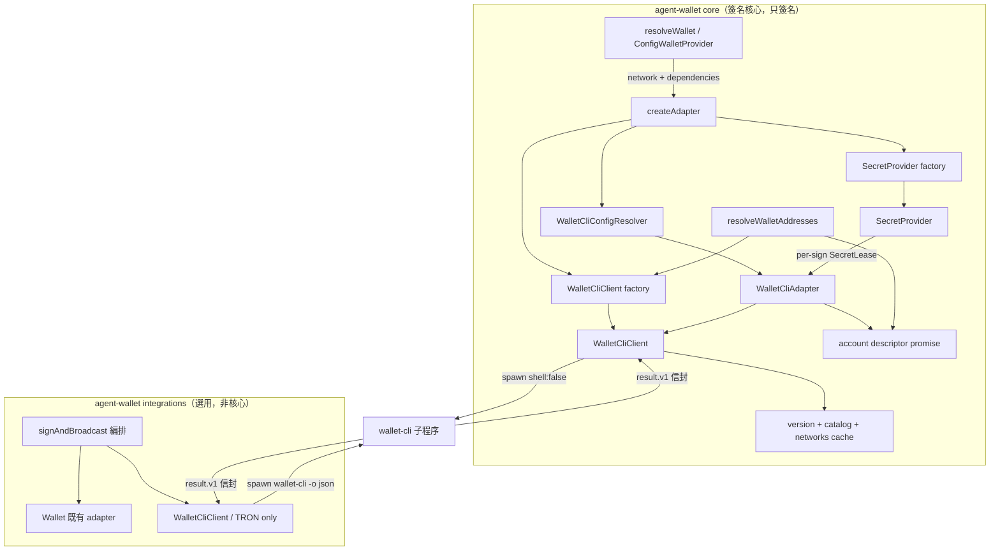
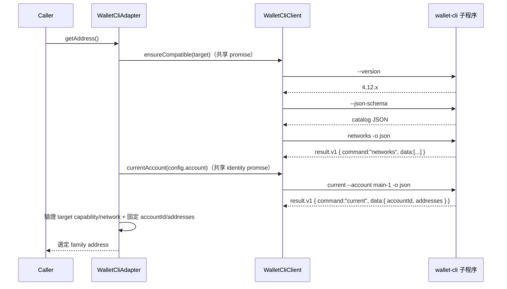
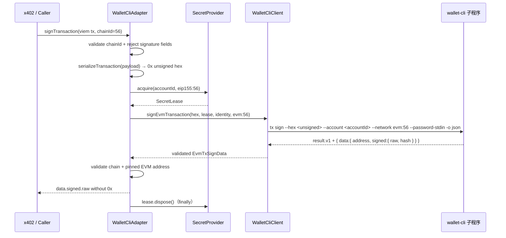
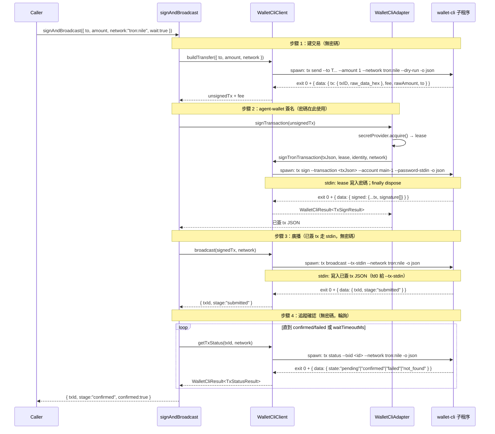

# Design Document — wallet-cli 對接

> **設計基準（2026-08-24）**：本版以已核准的 `requirements.md` 與 `../wallet-cli` 的 `feat/architecture-evm-extension` 原始碼為準。上一版的 TRON-only、eager password 與 Windows `shell: true` 設計已失效。

## Overview

本設計讓 agent-wallet 對接 wallet-cli，作為 TRON 與 EVM 外部簽名後端，同時保持核心「只簽名」邊界。

agent-wallet 只消費 wallet-cli 的公開 CLI 機器契約，不匯入其內部 module、不直接讀取 keystore。核心使用 `current`、`tx sign`、`message sign`、`typed-data sign`；既有 `integrations/wallet-cli/` 可使用 TRON 建交易、廣播與查詢命令。

- **雙 family 簽名**：TRON 交易走 JSON；EVM 交易由 viem 序列化成 unsigned hex；訊息與 typed data 依選定 family 交由 wallet-cli 簽名。
- **身分與網路固定**：adapter 建構時接收完整 agent-wallet network；第一次操作解析並固定 canonical account descriptor，後續命令一律顯式傳 network 與 `accountId`。
- **短生命週期秘密**：config 保留 `SecretValue`，每次簽章才向 `SecretProvider` 取得 `SecretLease`，完成後立即釋放。
- **先驗相容檢查**：第一次使用先驗證窄版本範圍、root catalog、family commands 與 network 清單；版本字串本身不代表 EVM 能力。
- **選用鏈操作**：`integrations/wallet-cli/` 明確維持 TRON-only，不進入核心 resolver 或 x402 路徑。

本地評估發現同一 checkout 的 source package 為 4.12.0 且包含 EVM，但現有 `dist` 與全域 binary 仍可能是舊的 TRON-only 產物。因此 client 同時檢查 `--version`、root `--json-schema` 與 `networks -o json`，不能以 package/version 單點判定。

### 密碼模型（關鍵設計決策）

wallet-cli keystore 密碼是外部簽名憑證，不是 agent-wallet 主密碼。config 形式保持與現行版本相容，但生命週期不再鏡像 Privy 的長期字串：

- `params.password` 繼續接受明文字串或 `SecretRef.exec`；config 檔維持 `0600` 與輸出 redaction。
- `WalletCliConfigResolver` 只校驗並保留 `SecretValue`，不執行 `SecretRef.exec`。
- builder 以可注入 factory 建立 `SecretProvider`；adapter 只保存 provider。
- 每次簽章取得一個 lease，client 將 lease 寫入 `--password-stdin`，adapter 在 `finally` 釋放。
- static provider 必然引用 config 中的既有字串；exec provider 則每次重新取得，預設不快取，並盡可能清除其 Buffer。
- 不支援 password env 覆寫；`SecretRef.exec` 可繼承受控的 subprocess environment，供既有密碼管理器 script 使用。

`resolveSecret()` 保留供 Privy 與既有公開 API 使用；wallet-cli 路徑改走 provider，不擴散成整個外部 signer 的強制重構。

### Goals

- 讓 `wallet_cli` 錢包在 `tron:<name>` 與 `eip155:<chainId>` 上提供與既有 Wallet/x402 相容的簽章結果。
- `WalletCliAdapter` 實作 `Wallet`、`Eip712Capable` 與新增的加法性 `MessageSigningCapable`；不把 `signMessage` 加進所有 Wallet 的必要介面。
- 沿用既有 adapter/provider/config 模式（與 Privy 先例一致）：client 在 `core/clients/`、adapter 在 `core/adapters/`、config resolver 在 `core/providers/`、類型在 `core/config.ts`、`createAdapter` 分派。
- 在標準 resolver/provider/builder 路徑注入 wallet-cli client 與 secret-provider factories。
- 以窄版本 + capability handshake、嚴格 context/data schema、輸出上限與 `shell: false` 建立可驗證的程序邊界。
- 保持既有 TRON-only 編排能力，並提供 deterministic fixture 與 opt-in 本地 binary 驗證。

### Non-Goals

- 不在 agent-wallet 核心實作交易廣播或 RPC 編排（廣播置於選用 `integrations/`）。
- 不直接讀取 / 解密 wallet-cli 的 keystore 檔案（金鑰由 wallet-cli 擁有）。
- 不匯入 wallet-cli 內部 ports（`Signer` / `Broadcaster`）。
- 不為 wallet-cli 密碼引入 env 覆寫（與 Privy 一致；日後若有需求再評估）。
- 不在 `integrations/wallet-cli/` 新增 EVM 建交易、RPC、廣播或追蹤。
- 不更動 wallet-cli 專案（僅消費其 CLI）。
- 不引入動態 params schema registry；中央 Zod discriminated union 與內部 builder registry 保持同步。
- 不承諾高吞吐常駐 signer；每筆簽章仍會啟動一個 wallet-cli 子程序。

### 關鍵假設（flagged）

1. **來源優先**：本次使用上一級 wallet-cli source/test 作為命令契約基準；其未建置或缺依賴不授權 agent-wallet 修改該 repo。
2. **完整 network**：wallet-cli adapter 不接受裸 family；TRON 使用 canonical `tron:<name>`，EVM 由 `eip155:<id>` 映射成 `evm:<id>`。
3. **單一 keystore 擁有者**：TRON/EVM 私鑰只由 wallet-cli keystore 擁有，agent-wallet 不重簽或二次解鎖。
4. **JavaScript 限制**：static password 已存在於 config string，無法可靠清零；設計重點是避免額外長期副本，並對 exec provider 使用可清除 Buffer。

## Architecture

### 既有架構分析

- `core/adapters/*`：純簽名器。`core/clients/privy.ts`：外部簽名來源的 HTTP 傳輸 client（置於 core 的先例）。
- `core/providers/wallet-cli-config.ts` 目前把 `SecretRef.exec` eager resolve 成 `password: string`；這是本次需要切斷的長期秘密引用。
- `core/providers/wallet-builder.ts` 目前在 registry builder 內直接 `new WalletCliClient()`，使標準 resolver 無法注入 client、launch resolver 或 secret provider。
- `core/providers/config-provider.ts` 以 walletId/type/network 快取 adapter；dependencies 固定於 provider instance，避免將 function identity 塞進 cache key。
- `core/config.ts`：`WalletConfigSchema`（zod discriminated union by `type` + `params`）。
- `core/address-resolution.ts` 已有 `whitelist` 雙地址結果，但 external signer 現在以缺 network 的 adapter 只回單一地址。
- steering（`structure.md`）：「Do not mix transaction broadcasting or RPC orchestration into this project; this project signs only.」

### 邊界與分層



- **`core/clients/wallet-cli.ts`**：launch target、資源受限的 subprocess runner、meta handshake、result envelope 與每命令 data schema。client 持有共享 handshake promise，不持有密碼。
- **`core/providers/wallet-cli-config.ts`**：校驗 account/password config，回傳 `SecretValue`；不執行秘密 script。
- **`core/secret-provider.ts`**：`SecretProvider`、`SecretLease`、static/exec providers 與預設 factory。既有 `secret-resolver.ts` 保留供 Privy 使用。
- **`core/adapters/wallet-cli.ts`**：network codec、identity pinning、TRON/EVM payload codec、簽章流程與 signer/context 驗證；只簽不廣播。
- **`core/resolver.ts` / `core/providers/config-provider.ts` / `wallet-builder.ts`**：向下傳遞 immutable `WalletDependencies`。
- **`core/address-resolution.ts`**：直接以 client 查 account descriptor；不建構缺 network 的 adapter。
- **`integrations/wallet-cli/`**：維持 TRON-only、選用、可安全移除。

> Steering 處理：簽名 client/adapter/config-resolver 屬 core（與 Privy 一致，皆為「外部簽名來源」）；廣播/查詢在 `integrations/`。建議在 `structure.md` 補述 `integrations/` 層性質。核心契約 `Wallet` 仍只簽名。

### 對接接合點（handoff）

| 階段           | 資料形狀                                                              | 產生者               | 消費者                                        |
| -------------- | --------------------------------------------------------------------- | -------------------- | --------------------------------------------- |
| 相容檢查       | `--version` + root `--json-schema` + `networks -o json`               | wallet-cli           | client handshake cache                        |
| 固定身分       | `current [--account]` → canonical `accountId` + partial addresses     | wallet-cli           | adapter identity promise / address resolver   |
| TRON 簽交易    | `tx sign --transaction <json>` → `data.signed`                        | wallet-cli           | adapter → `{ family: "tron", transaction }`   |
| EVM 簽交易     | viem transaction → unsigned hex → `tx sign --hex` → `data.signed.raw` | adapter + wallet-cli | adapter → `{ family: "evm", rawTransaction }` |
| 簽訊息         | UTF-8 bytes → `message sign --message` → `data.signature`             | adapter + wallet-cli | `MessageSigningCapable.signMessage`           |
| 簽 typed-data  | `typed-data sign --typed-data <json>` → `data.signature`              | wallet-cli           | adapter 去除 `0x` 前綴                        |
| 建交易（編排） | `tx send --dry-run` → `data.tx`（未簽）+ `data.fee`                   | wallet-cli           | `Wallet.signTransaction`                      |
| 廣播（編排）   | `tx broadcast --tx-stdin` → `data.txId` + `data.stage`                | wallet-cli           | caller                                        |
| 確認（編排）   | `tx status` → `data.state` 四態                                       | wallet-cli           | caller                                        |

### Technology Stack

| Layer      | Choice / Version                                                    | Role                                                | Notes                             |
| ---------- | ------------------------------------------------------------------- | --------------------------------------------------- | --------------------------------- |
| 子程序傳輸 | Node `child_process.spawn`                                          | 呼叫 `wallet-cli`                                   | 無新相依                          |
| 信封解析   | `zod`（既有）                                                       | 校驗 `wallet-cli.result.v1`                         | 與 core 風格一致                  |
| EVM codec  | `viem.serializeTransaction`（既有）                                 | 將 Wallet/x402 payload 轉 unsigned serialized tx    | 不新增相依                        |
| stdin 通道 | Node stream                                                         | 餵 `--password-stdin`（簽名）/ `--tx-stdin`（廣播） | 單一消費者限制                    |
| 執行期相依 | `@tron-walletcli/wallet-cli >=4.12.0 <5`（optional peer，Node ≥20） | TRON/EVM 簽名 + TRON 鏈操作                         | capability handshake 仍為必要條件 |

## Component Design

### Part 1 — 核心 TRON/EVM 外部簽名後端

#### 1.1 Config 擴充（`core/config.ts`）

```ts
export const WalletCliWalletParamsSchema = z.object({
  account: z.string().optional(), // wallet-cli 帳戶 label/accountId；省略則用 active account
  password: SecretValueSchema, // string | { exec, timeout? }
});
export type WalletCliWalletParams = z.infer<typeof WalletCliWalletParamsSchema>;
```

中央 `WalletConfigSchema` 與 `wallet_cli` params 形狀保持不變；本次不做 P2 動態 schema registry。

#### 1.2 `WalletCliConfigResolver`（`core/providers/wallet-cli-config.ts`）

resolver 仍 extends `ExternalSignerConfigResolver`，但 wallet-cli credential 不再呼叫基底的 `resolveCredential()`：

```ts
export type WalletCliConfig = {
  account?: string;
  password: SecretValue;
};
export type WalletCliConfigSource = {
  account?: string;
  password?: SecretValue;
};
export class WalletCliConfigResolver extends ExternalSignerConfigResolver<
  WalletCliConfig,
  WalletCliConfigSource
> {
  resolve(): Promise<WalletCliConfig>;
}
```

- `account` trim 後為空視為省略；省略時只在第一次 identity resolution 使用 active account。
- password 缺失、空字串或不合法 `SecretRef` 立即拋 `WalletCliConfigError`，但合法 secret 不在此階段取得。
- resolver 不處理 password 內容；預設 provider factory 延續既有 `resolveSecret()` 的 trim/空值語意，避免既有 config 行為漂移。
- config-only，不 merge password env。Privy 仍使用原有 eager `resolveSecret()`，避免無關 API 變更。

#### 1.3 Secret provider（新增 `core/secret-provider.ts`）

```ts
export interface SecretContext {
  label: string;
  accountId: string;
  network: string;
}

export interface SecretLease {
  writeTo(destination: NodeJS.WritableStream): Promise<void>;
  dispose(): Promise<void>; // idempotent
}

export interface SecretProvider {
  acquire(context: SecretContext): Promise<SecretLease>;
}

export type SecretProviderFactory = (
  value: SecretValue,
  context: { label: string },
) => SecretProvider;
```

- `StaticSecretProvider`：在 factory 建立時沿用現行 trim/空值規則並保存該 config string；每次 acquire 建立短期 lease，不在 adapter/client 再存副本。JavaScript string 無法清零，此限制寫入 API 文件。
- `ExecSecretProvider`：每次 acquire 執行 `SecretRef.exec`，stdout 直接累積為有上限的 Buffer；以 Buffer 操作重現現行 leading/trailing whitespace trim，不先建立完整 JS string。空輸出失敗；lease dispose 將 Buffer `fill(0)`。
- lease 是 one-shot：`writeTo()` 第二次呼叫、dispose 後寫入或重複消費均失敗；`dispose()` 本身可安全重複呼叫。
- exec 預設 timeout 10 秒、stdout 64 KiB、stderr 16 KiB；超限立即終止。錯誤只含分類、exit code、timeout 與 path，不含 stdout/stderr。
- `SecretRef.exec` 仍只接受已驗證存在的檔案路徑，不接受 inline command 或額外 shell args。POSIX 直接執行；Windows `.cmd/.bat` 以固定 `ComSpec` argv 啟動且 spawn option 仍為 `shell: false`，其他 executable 直接啟動。
- provider 自訂 TTL cache 可由注入實作自行提供；預設 providers 不跨簽章快取。

#### 1.4 Network codec（新增於 adapter/client 共用模組）

```ts
interface WalletCliNetworkTarget {
  family: "tron" | "evm";
  agentNetwork: string; // tron:nile | eip155:56
  cliNetwork: string; // tron:nile | evm:56
  requestedChainId?: string; // EVM only
}
```

- `tron:<name>` 必須為非空 canonical id；存在性與實際 chainId 由 handshake network row 確認。
- `eip155:<id>` 的 id 必須是正十進位整數、無前導符號且可安全轉為 viem `number`；映射成 `evm:<id>`。
- 裸 `tron` / `eip155`、alias（如 `bsc`）、其他 CAIP namespace 與空白值同步 fail-fast。
- handshake 解析出的 network row 為 `{ id, family, chainId }`，必須與 target family/id 相符；所有 chain command 回應再與該 row 比對。

#### 1.5 `WalletCliClient`（`core/clients/wallet-cli.ts`）

client 職責分為 launch、meta handshake、result-envelope command 三層；不接收或保存 `SecretProvider`。

```ts
export interface WalletCliLaunchTarget {
  command: string;
  argsPrefix?: readonly string[];
}

interface WalletCliClientOptions {
  launchTarget?: WalletCliLaunchTarget;
  binary?: string; // 向後相容；解析成 launchTarget
  timeoutMs?: number; // default 60s
  killGraceMs?: number; // default 5s
  maxStdoutBytes?: number; // default 2 MiB
  maxStderrBytes?: number; // default 64 KiB
  env?: NodeJS.ProcessEnv;
}
type WalletCliWarning = string | { code: string; message: string };
interface WalletCliResult<T> {
  schema: "wallet-cli.result.v1";
  success: true;
  command: string;
  data: T;
  chain?: { family: string; network: string; chainId: string };
  meta: { durationMs: number; warnings: WalletCliWarning[] };
}
```

公開/adapter-facing 方法採窄輸入，不讓 adapter 任意拼接 argv：

- `ensureCompatible(target?)`：共用 base handshake promise；有 target 時再驗證 family commands 與 network row。
- `currentAccount(accountRef?)`：`current [--account] -o json`；只接受 `command === "current"` 且 chain 缺席。
- `signTronTransaction(json, lease, identity, network)`：`tx sign --transaction ... --account <accountId> --network <id> --password-stdin -o json`。
- `signEvmTransaction(unsignedHex, lease, identity, network)`：使用 `--hex`，不得使用 TRON `--transaction`。
- `signMessage(message, lease, identity, network)` 與 `signTypedData(json, lease, identity, network)`。
- `run<T>()` 保留供 TRON integration 使用，但必須明確傳入 command/context validator；不再允許任意泛型 cast 代表已驗證。

程序 runner 的共同規則：

1. 所有 spawn 使用 `shell: false`，stdin/stdout/stderr 為 pipe；寫入 lease 後關閉 stdin。
2. stdout/stderr 在接收 chunk 時即檢查上限，超限立即 TERM，經 grace period 後 KILL，後續 chunk 不再保存。
3. timeout、abort、stdin EPIPE、spawn error 與 close 只能 settle promise 一次；timer 與 listener 必須清理。
4. invalid output 錯誤不附原始 stdout/stderr，只附 command、exit code、byte count、是否超限及穩定 code。
5. 正常 envelope 的 `error.message` 先移除控制字元並截斷至 512 字元，再放入公開錯誤。

**退出碼分派**：

- exit 0 + valid success envelope → 由 command/context/data schema 通過後回傳。
- exit 1 → 拋 `WalletCliExecutionError`（帶 `code`：`rpc_error` / `timeout` / `auth_failed` / `watch_only_no_signer` / `signing_rejected` / `tx_integrity` …）。
- exit 2 → 拋 `WalletCliUsageError`（`usage_error` / `missing_option` / `invalid_value` / `weak_password` / `secret_source_error` …）。
- exit/envelope success 狀態矛盾、缺必要 data、錯 command/context → `WalletCliExecutionError(code: "contract_mismatch")`。
- spawn ENOENT → `WalletCliNotFoundError`；不回傳可能含秘密的 OS command line。

#### 1.6 Capability handshake

`--version` 與 root `--json-schema` 是 meta raw JSON/text，不是 `wallet-cli.result.v1`；`networks -o json` 則走一般 envelope parser。client 因此使用獨立的 bounded `runMeta()`，不把 catalog 偽裝成 result envelope。

base handshake 以單一 promise 依序或並行取得：

1. `wallet-cli --version`：解析穩定版 semver，接受 `>=4.12.0 <5.0.0`，拒絕 prerelease 與額外輸出。
2. `wallet-cli --json-schema`：驗證 `{ tool: "wallet-cli", version, commands[] }`，catalog version 必須與 `--version` 相同。
3. `wallet-cli networks -o json`：驗證 `command === "networks"`、neutral envelope 及 `{ id, family, chainId }[]`。

catalog 最少要求 neutral `current`，並針對 target family 檢查 `tx.sign`、`message.sign`、`typed-data.sign` 的 `families` 含 `tron` 或 `evm`。catalog/network 結果可含未知命令、欄位、warning code 與額外 network。版本符合但能力缺失仍 fail-fast，解決本地 source/dist 同版號漂移。

#### 1.7 `WalletCliAdapter`（`core/adapters/wallet-cli.ts`）

adapter 實作 `Wallet`、`Eip712Capable`、`MessageSigningCapable`。建構時同步解析 network 格式；network 缺失或裸 family 立即失敗。network 存在性與 capabilities 在第一次 async 操作確認。

```ts
export interface MessageSigningCapable {
  signMessage(message: Uint8Array, options?: SignOptions): Promise<string>;
}

class WalletCliAdapter implements Wallet, Eip712Capable, MessageSigningCapable {
  constructor(
    config: WalletCliConfig,
    client: WalletCliClient,
    secretProvider: SecretProvider,
    network: string,
  ) {}
}
```

adapter 內有兩個共享 promise：

- `compatibilityPromise` 由 client 管理並跨 adapter/client 操作共用。
- `identityPromise` 由 adapter 管理；第一次呼叫 `currentAccount(config.account)`，驗證 `accountId` 與 family address 後固定 `{ accountId, addresses }`。並行呼叫共用；成功後永不重新讀 active account。第一次失敗可清除 promise，讓明確的後續呼叫重試。

方法對應：

- `getAddress()`：等待 compatibility + identity，回選定 family 的固定地址；不取得秘密。
- `signTransaction(payload)`：先等待 readiness，再依 family codec 產生 CLI payload，取得 lease，呼叫窄 client method，`finally` dispose。
- `signTypedData(data)`：EVM `domain.chainId` 若存在須等於 target chainId；TRON 不把 `tron:<name>` 與 TIP-712 numeric domain chainId混為一談，交由 wallet-cli family strategy 驗證。回傳去 `0x` 簽名。
- `signMessage(bytes)`：以 fatal UTF-8 decoder 解碼；失敗則在啟動子程序前拋明確 `SigningError`。回傳去 `0x` 簽名。

EVM transaction codec 使用既有 `viem.serializeTransaction`：

1. payload `chainId` 必填且等於 `eip155:<id>`；拒絕既有 `r`/`s`/`v`/`yParity` 等 signature 欄位。
2. 支援 agent-wallet 現有的 legacy、EIP-2930、EIP-1559 交易形狀；無法序列化或 family 欄位混用時 fail-fast。EIP-4844 不在本期承諾。
3. unsigned serialized hex 保留 `0x` 傳入 wallet-cli `--hex`；結果要求 `{ signed: { raw, hash }, address }`，回 caller 前只移除 raw 的 `0x`。

TRON codec 保留 transaction object 與完整 `signed.signature[]`；結果以 typed artifact 回傳，不再要求呼叫端解析 JSON 字串。

所有 signing result 都必須：`command` 精確匹配、chain 與 handshake network row 一致、`data.address` 等於 identity address。EVM 地址先正規化 checksum 後比較，TRON base58 精確比較；任何不一致視為 `contract_mismatch`，不回傳簽章。

**密碼處理**：

- adapter 在 identity 已固定後才以 `{ accountId, network }` context acquire lease；密碼經 stdin 傳 wallet-cli，永不進 argv/env/日誌。
- 一個簽章對應一個 lease；client 不負責快取秘密，adapter 在所有結果路徑 dispose。
- 密碼缺失 → resolver 階段即拋 `WalletCliConfigError`（fail-fast，早於簽名）。
- 密碼錯（wallet-cli `auth_failed`）→ 透傳為 `WalletCliExecutionError`（exit 1）。
- 密碼不符策略（`weak_password`，exit 2）→ `WalletCliUsageError`。

#### 1.8 Provider / 建構接線與依賴注入

依賴只在 provider 建構時設定，之後 immutable：

```ts
export interface WalletCliDependencies {
  readonly clientFactory?: (context: {
    network?: string
    purpose: 'signing' | 'address-resolution'
  }) => WalletCliClient
  readonly secretProviderFactory?: SecretProviderFactory
}

export interface WalletDependencies {
  readonly walletCli?: WalletCliDependencies
}

resolveWallet({ network, dir, walletId, dependencies? })
resolveWalletProvider({ network, dir, dependencies? })
new ConfigWalletProvider(dir, { network, dependencies? })
createAdapter(conf, configDir, network, dependencies?)
```

`ExternalSignerBuilder` context 增加 `dependencies?: WalletDependencies`。wallet-cli builder 使用注入 factory 或預設 factory 建 client/provider，再建構 adapter。Privy/raw-secret builder 不讀 wallet-cli dependencies。

provider instance 捕捉固定 dependencies；每次不同 dependencies 會建立不同 provider 與 cache，因此既有 walletId/type/network cache 不需比較 function identity。network 仍是 cache key，防止同一 wallet-cli account 的 TRON/EVM adapter 混用。

#### 1.9 地址解析

`resolveWalletAddresses(conf, options?)` 增加選用 dependencies，但不要求 network。wallet-cli 分支：

1. config resolver 只取得 account ref，不解析 password。
2. 以 address-resolution purpose 建 client，執行 base compatibility/current capability 與 `current [--account]`。
3. 以 canonical account descriptor 建 entries：EVM 與 TRON 都有時回既有 `whitelist` tuple；只有一個 family 時回 `single` canonical entry。
4. 不建立 `WalletCliAdapter`，所以不會繞過「adapter network 必填」規則，也不會 acquire secret。

Privy 與 raw-secret 路徑維持現行行為。

#### 1.10 匯出（`src/index.ts` 與 `src/advanced.ts`）

```ts
// @bankofai/agent-wallet/advanced
export { WalletCliAdapter } from "./core/adapters/wallet-cli.js";
export { WalletCliClient } from "./core/clients/wallet-cli.js";
export { WalletCliConfigResolver } from "./core/providers/wallet-cli-config.js";
export type {
  WalletCliWalletParams,
  WalletCliConfig,
  WalletCliNetworkTarget,
} from "...";
export type {
  WalletCliClientOptions,
  WalletCliLaunchTarget,
  WalletCliResult,
  WalletCliWarning,
} from "...";
export type {
  SecretProvider,
  SecretLease,
  SecretProviderFactory,
  SecretContext,
} from "...";

// @bankofai/agent-wallet（穩定 root）
export type {
  WalletDependencies,
  WalletCliDependencies,
  MessageSigningCapable,
} from "...";
export {
  WalletCliConfigError,
  WalletCliNotFoundError,
  WalletCliUsageError,
  WalletCliExecutionError,
} from "...";
```

### Part 2 — 選用鏈操作編排（`integrations/wallet-cli/`）

非核心、可安全移除且**維持 TRON-only**。復用 client 的受限 runner，但每個方法仍提供 command/data/context validator，不以 unchecked generic cast 接受結果。EVM RPC、建構、廣播與追蹤不在本期。

#### 2.1 廣播 / 查詢方法

- `buildTransfer(opts)` → `tx send --dry-run`：未簽 tx + fee 估算（不需密碼）。
- `broadcast(signedTx)` → `tx broadcast --tx-stdin`：已簽 tx JSON 走 stdin（不需密碼）。
- `getTxStatus(txid)` → `tx status`：四態。
- `getBalance(address?)` → `account balance`。
- `getTxInfo(txid)` → `tx info`。

#### 2.2 `signAndBroadcast` 編排助手

串接：建交易 → agent-wallet 簽名 → 廣播 → （可選）追蹤。純函式，注入 `Wallet` 與 `WalletCliClient`。

```ts
interface SignAndBroadcastParams {
  to: string;
  amount?: string; // 與 rawAmount 互斥
  rawAmount?: string; // SUN / token base units
  token?: string; // 與 contract/assetId 互斥
  contract?: string;
  assetId?: string;
  network: `tron:${string}`; // 必填；runtime 仍驗證 canonical network
  wait?: boolean;
  waitTimeoutMs?: number;
}
```

流程：

1. `client.buildTransfer(...)` → 未簽 tx（`txID`/`raw_data_hex`）。
2. `wallet.signTransaction(unsignedTx)` → 已簽 tx JSON（**agent-wallet 核心簽名**；若 `wallet` 為 `WalletCliAdapter`，則再委派 wallet-cli `tx sign`——密碼在此環節由 adapter 內部使用）。
3. `client.broadcast(JSON.parse(signedTxJson))` → `txId`。
4. `wait` 為真則輪詢 `client.getTxStatus(txId)` 至 `confirmed`/`failed`。
5. 回傳 `{ txId, stage, confirmed?, failed? }`。

> 關鍵：**密碼只在 adapter 內部以 lease 使用**；wallet-cli 建交易與廣播皆不 acquire secret。若傳入非 TRON network，integration 在任何 RPC/子程序前 fail-fast。

## Extensibility — 新增外部錢包

本設計預期後續新增更多外部簽名器（其他 WaaS、硬體錢包、其他 CLI）。為避免每新增一個即重複一份樣板、並使 `createAdapter` 的 if-else 持續膨脹，引入三項共享抽象（皆為既有 Privy 先例的提取，非新發明）。

### 共享錯誤階層（`core/errors.ts`）

外部簽名器共用一組錯誤基底，使呼叫端能以類別（而非逐一列舉）捕捉：

```
WalletError
├── ExternalSignerError            外部簽名器基底
│   ├── ExternalSignerConfigError      config 解析/必填校驗失敗
│   ├── ExternalSignerExecutionError   執行失敗（auth_failed / rpc_error / timeout …）
│   ├── ExternalSignerUsageError       呼叫端錯誤（壞旗標，重試無益）
│   └── ExternalSignerNotFoundError    後端不可用（binary 不在 PATH 等）
├── SigningError / NetworkError / …    既有，不變
```

- 新增外部錢包用此階層，不再每型各造 `XxxConfigError`。
- **Privy 回填已存在**：`PrivyConfigError` / `PrivyRequestError` / `PrivyAuthError` / `PrivyRateLimitError` 已 extend 對應共享基底；本期保持其 `instanceof WalletError` 與既有 class 行為。

### 共享 config resolver 基底（`core/providers/external-signer-config.ts`）

`PrivyConfigResolver` 與 `WalletCliConfigResolver` 的「config-only、正規化(trim)、必填校驗、拋 ConfigError」邏輯一致，提取為泛型基底：

```ts
abstract class ExternalSignerConfigResolver<TConfig, TSource> {
  constructor(opts: { source?: TSource }) {}
  abstract resolve(): Promise<TConfig>;
  protected normalizeValue(v: string | undefined): string | undefined; // trim
  protected requireFields(merged: TSource, required: string[]): string[]; // 偵測缺失
}
```

新外部錢包的 resolver extend 此基底，僅宣告自己的欄位與必填集。

### 註冊表分派（`core/providers/wallet-builder.ts`）

外部簽名器以內部 registry 集中分派，新增型別不必編輯 `createAdapter` 主幹：

```ts
type ExternalSignerBuilder = (
  params: unknown,
  ctx: { network?: string; dependencies?: WalletDependencies },
) => Promise<Wallet>;
const externalSignerRegistry = new Map<string, ExternalSignerBuilder>();
function registerExternalSigner(
  type: string,
  builder: ExternalSignerBuilder,
): void;
```

`registerExternalSigner` 與 registry 都是模組內部實作，不從 root 或 advanced entry point 匯出。`createAdapter` 對外部型走 `externalSignerRegistry.get(conf.type)`；`raw_secret` 維持 if-else。config schema（Zod discriminated union）仍需登錄新型的 params schema，以維持型別安全，避免形成 builder 可註冊但 config 永遠無法通過的半套 plugin API。

### 新增外部錢包的步驟（擴充配方）

1. `core/base.ts` + `core/config.ts`：`WalletType` enum 新增值（base.ts）、params schema 加入 union、refine 補新型分支（config.ts）。
2. `core/providers/external-signer-config.ts`：宣告 resolver（extend 共享基底，定義欄位/必填）。
3. `core/clients/<name>.ts`：實作傳輸 client（HTTP / 子程序 / 其他）。
4. `core/adapters/<name>.ts`：實作 `Wallet`（+ `Eip712Capable`），委派給 client，做簽名格式正規化。
5. `core/errors.ts`：錯誤 extend 共享 `ExternalSigner*` 基底（不再各造基底）。
6. `core/providers/wallet-builder.ts`：在模組內登錄 `registerExternalSigner('<type>', builder)`。
7. `src/advanced.ts`：只在需要時匯出具體 adapter/client；不匯出內部 registry。

> 取捨：不引入完全動態的 plugin 系統（如單一 `external` 型 + dispatch）——那會犧牲 Zod discriminated union 的編譯期型別安全，且各外部簽名器的 params 形狀確實不同。內部註冊表 + 共享基底在「集中分派/複用」與「保留型別安全」間取得平衡；新增 signer 是明確的中央 schema 變更，不是假裝成 runtime plugin。

## Installation & Dependency

agent-wallet 以**子程序**呼叫 wallet-cli（非程式碼 import），故相依關係是「執行期需有 `wallet-cli` binary 可用」，而非 bundle 依賴。據此選定相依模型與安裝流程。

### 相依模型：optional peer dependency（非硬依賴）

在 agent-wallet `package.json` 宣告：

```json
{
  "peerDependencies": {
    "@tron-walletcli/wallet-cli": ">=4.12.0 <5.0.0"
  },
  "peerDependenciesMeta": {
    "@tron-walletcli/wallet-cli": { "optional": true }
  }
}
```

**為何不列為 `dependencies`（硬依賴）**：

| 顧慮      | 硬依賴的問題                                                                                                  | optional peer 的處理                                       |
| --------- | ------------------------------------------------------------------------------------------------------------- | ---------------------------------------------------------- |
| Node 版本 | wallet-cli 需 Node ≥20，agent-wallet 承諾 ≥18；硬依賴變相把所有使用者的 Node 下限抬到 20                      | 僅 `wallet_cli` 類型使用者需 ≥20；EVM/Privy 使用者不受影響 |
| 安裝足跡  | wallet-cli 帶 Ledger HW、tronweb、axios、yargs 等重依賴，會被強裝到所有 agent-wallet 使用者（含純 EVM/Privy） | 僅需要者安裝                                               |
| 授權      | wallet-cli 為 LGPL-3.0，agent-wallet 為 MIT；硬依賴把 LGPL 拉入所有使用者的依賴樹                             | 可選，使用者自行選擇引入                                   |
| 耦合/穩定 | agent-wallet 依賴具體命令、旗標與 envelope                                                                    | peer 限於經驗證的 4.x 範圍，且 runtime 再驗證能力          |
| 概念      | wallet-cli 是「外部簽名後端」（自有 keystore、子程序驅動），非程式庫                                          | peer 如實建模「agent-wallet 可用 wallet-cli，若你提供」    |

### Launch target 解析順序（runtime，`WalletCliClient` 首次呼叫時延遲解析）

1. 顯式 `WalletCliClientOptions.launchTarget`。
2. 向後相容的 `options.binary`。
3. `AGENT_WALLET_WALLET_CLI_PATH`。
4. 以 Node module resolution 找到 optional peer package 的 `package.json` 與宣告的 `bin` JavaScript entrypoint，產生 `{ command: process.execPath, argsPrefix: [entrypoint] }`。
5. PATH 上可由 `shell: false` 直接啟動的 executable。
6. 皆無 → `WalletCliNotFoundError`，提示安裝、設定 path 或注入 launch target。

若顯式 path/env/binary 以 `.js`、`.mjs` 或 `.cjs` 結尾，client 使用目前 Node 啟動。Windows `.cmd` shim 不以 `shell: true` 執行；預設 resolver 優先找 package JS entrypoint，無法安全解析 shim 時回明確錯誤，要求使用 JS path/launch target。不得硬編碼 `node_modules/.bin` 猜測。

解析 launch target 後立即進行 version/catalog/network handshake；成功的 target 與 handshake promise 綁定於該 client。變更 binary/env 需建立新 client，避免執行中切換契約。

### Node 版本守衛

當 launch target 使用目前 Node 執行 JavaScript entrypoint 時，若 Node <20 應在 spawn 前拋 `unsupported_runtime`。對獨立 executable 不預判其內部 runtime，但仍將其明確回報的 runtime failure 分類。此守衛只影響 `wallet_cli` 路徑，不改 agent-wallet 整體 `engines`（維持 ≥18）。

### 安裝流程（依使用者類型）

**A. SDK 使用者（需要 TRON 或 EVM wallet-cli signer）**

```bash
npm install @bankofai/agent-wallet
npm install @tron-walletcli/wallet-cli          # 本地 optional peer；預設解析 package JS entrypoint
# 或全域：
npm install -g @tron-walletcli/wallet-cli       # 上 PATH，無需環境變數
```

- 先用 wallet-cli `create`/`import` 建立金鑰與帳戶。
- 於 agent-wallet config 加 `wallet_cli` 條目；呼叫 resolver 時傳完整 `tron:<name>` 或 `eip155:<id>`。

**B. agent-wallet CLI 全域使用者（`npm install -g @bankofai/agent-wallet`）**

```bash
npm install -g @bankofai/agent-wallet
npm install -g @tron-walletcli/wallet-cli       # 兩者皆全域，PATH 可見
```

Unix 可直接使用 PATH executable；Windows npm 全域安裝通常只暴露 `.cmd` shim，應設定 `AGENT_WALLET_WALLET_CLI_PATH` 指向套件實際 JavaScript entrypoint，或注入明確 launch target，不能回退 `shell: true`。

**C. 開發 / CI（agent-wallet repo）**

- 一般 CI 使用 repo 內 deterministic fixture CLI，不依賴網路或真實 keystore。
- opt-in 測試只讀使用 `AGENT_WALLET_TEST_WALLET_CLI_PATH` 指定的已就緒 entrypoint；不隱式使用全域 binary。
- 真實 signing probe 額外要求 account、network 與 password exec path；缺任一項即清楚 skip，不把未執行呈現為 pass。
- 本次不在 `../wallet-cli` 安裝依賴或建置；其 source/dist 不一致作為驗證報告，而非由 agent-wallet 修復。

### 降級語意

`wallet_cli` 錢包類型為**可選能力**：未安裝 wallet-cli 時，agent-wallet 其餘功能（EVM 簽名、Privy、`raw_secret`）完全不受影響。建立或使用 `wallet_cli` 條目時才需 binary 可用。

## System Flows

以下流程標示 handshake、identity 與 per-sign secret lease 的順序。所有 chain command 都顯式傳 canonical network/account；不依賴 wallet-cli default network 或操作期間的 active account。

### 流程 A：第一次 readiness + identity（無密碼）

`getAddress()` 或第一次簽章都會進入此流程。先完成 client handshake，才查詢帳戶；避免不相容產物在驗證前參與 identity resolution。兩個階段各自使用共享 promise。



若並行呼叫先後抵達，只有第一個建立 promise。handshake 失敗保留於 client；建立新 client 才重試。identity 第一次失敗可重試，成功後永不因 active account 改變而切換。

### 流程 B：TRON 簽交易

payload 為未簽 TRON JSON，回傳完整已簽 tx。lease 只存在於這次簽章。

```mermaid
sequenceDiagram
  participant App as Caller
  participant Signer as WalletCliAdapter
  participant Client as WalletCliClient
  participant Cli as wallet-cli 子程序

  participant Secret as SecretProvider

  App->>Signer: signTransaction(TRON payload)
  Signer->>Signer: await readiness; validate TRON shape
  Signer->>Secret: acquire(accountId, tron:nile)
  Secret-->>Signer: SecretLease
  Signer->>Client: signTronTransaction(txJson, lease, identity, target)
  Client->>Cli: tx sign --transaction <json> --account <accountId> --network tron:nile --password-stdin -o json
  Note over Client,Cli: stdin: lease.writeTo(child.stdin)<br/>stdout/stderr: bounded
  alt 完整性檢查通過
    Cli-->>Client: result.v1 + chain + { data:{ address, signed:{ signature:[] } } }
    Client-->>Signer: validated TronTxSignData
    Signer->>Signer: 驗證 signer == pinned TRON address
    Signer-->>App: { family: "tron", transaction: data.signed }
  else 完整性不符
    Cli-->>Client: exit 1 + { error: { code:"tx_integrity", message } }
    Client-->>Signer: 拋 WalletCliExecutionError(code:"tx_integrity")
  end
  Signer->>Secret: lease.dispose()（finally）
```

### 流程 C：EVM 簽交易



message 與 typed-data 使用相同 lease 流程；差別只在 payload codec 與 data schema。任何 readiness、codec 或 identity 失敗都發生在 acquire 前。

### 流程 D：TRON 端到端簽名 + 廣播（密碼僅在第 2 步）

編排流程展示「密碼只在簽名環節」：建交易（`--dry-run`，無密碼）→ agent-wallet 簽名（密碼在此用）→ 廣播（已簽 tx，無密碼）→ 追蹤（無密碼）。已簽 tx JSON 經 stdin（`--tx-stdin`）傳遞，因廣播不帶 `--password-stdin`，fd0 空出可吃 `--tx-stdin`。



### 退出碼分派匯整（所有流程共用）

```
exit 0            → success:true, 回傳 data
exit 1            → WalletCliExecutionError（code: auth_failed | rpc_error | timeout | tx_integrity | signing_rejected | watch_only_no_signer | internal_error …）
  └─ timeout      → 交易可能仍在飛；編排不自動重送，回「以 tx status 複核」
exit 2            → WalletCliUsageError（code: usage_error | missing_option | invalid_value | weak_password | secret_source_error …；呼叫端壞掉，重試無益）
spawn ENOENT      → WalletCliNotFoundError（提示 npm i -g @tron-walletcli/wallet-cli）
輸出/timeout      → WalletCliExecutionError（output_limit | timeout；終止子程序，不附原始輸出）
契約/context 不符 → WalletCliExecutionError（contract_mismatch）
```

## Data Models / Contracts

### `wallet-cli.result.v1` 信封（zod）

```ts
const WarningSchema = z.union([
  z.string(),
  z.object({ code: z.string(), message: z.string() }),
]);
const CommonEnvelopeSchema = z.object({
  schema: z.literal("wallet-cli.result.v1"),
  command: z.string(),
  meta: z.object({ durationMs: z.number(), warnings: z.array(WarningSchema) }),
  chain: z
    .object({ family: z.string(), network: z.string(), chainId: z.string() })
    .optional(),
});
const ResultEnvelopeSchema = z.discriminatedUnion("success", [
  CommonEnvelopeSchema.extend({ success: z.literal(true), data: z.unknown() }),
  CommonEnvelopeSchema.extend({
    success: z.literal(false),
    error: z.object({
      code: z.string(),
      message: z.string(),
      details: z.unknown().optional(),
    }),
  }),
]);
```

Zod 預設容許並剝除未知欄位，因此契約可加法演進；必要欄位、success/error 對應與命令資料仍嚴格。成功 envelope 不能省略 data/meta，失敗 envelope 不能省略 error。

### 命令資料模型（型別化介面）

- `WalletCliCatalog`：`{ tool:'wallet-cli', version, commands:[{ id, kind, families?, capability?, ... }] }`。
- `NetworkRow`：`{ id, alias?, family, chainId, feeModel?, endpoint? }`。
- `CurrentAccountData`：`{ accountId, label?, type, index, active, addresses:{ tron?, evm? }, seedId?, family?, path?, derivationPath? }`。
- `TronTxSignData`：`{ kind:'sign', mode:'sign-only', address, txId?, signed:{ signature:string[], ... } }`。
- `EvmTxSignData`：`{ kind:'sign', mode:'sign-only', address, txId?, signed:{ raw:Hex, hash:Hex } }`。
- `MessageSignData`：`{ address, message, signature }`。
- `TypedDataSignData`：`{ address, primaryType, digest, signature }`。
- `BuildTransferResult`：`{ kind, mode: 'dry-run', tx: UnsignedTx, fee, rawAmount, to }`
- `BroadcastResult`：`{ kind: 'broadcast', stage, txId, confirmed?, failed?, blockNumber? }`
- `TxStatusResult`：`{ state, confirmed, failed }`
- `AccountBalanceResult`：`{ address, balance, decimals, symbol }`

每個 schema 使用 `.passthrough()` 等價的加法性政策，但上列必要欄位不可缺少。TRON-only integration schemas 不套用到 EVM signing data。

### `wallets_config.json` 範例（格式向後相容）

```json
{
  "active_wallet": "treasury",
  "wallets": {
    "treasury": {
      "type": "wallet_cli",
      "params": {
        "account": "main-1",
        "password": {
          "exec": "/opt/secrets/wallet-cli-password",
          "timeout": 10000
        }
      }
    },
    "default_privy": {
      "type": "privy",
      "params": { "app_id": "...", "app_secret": "...", "wallet_id": "..." }
    }
  }
}
```

### 一致性與完整性

- 金額一律以十進位**字串**處理，絕不轉 JS number。
- 簽名格式正規化集中於 adapter：TRON 回 JSON；EVM raw transaction、message 與 typed-data signature 去 `0x`。
- EVM transaction 的 chainId 在 viem serialization 前驗證；wallet-cli envelope 的 chain 再次以 handshake network row 驗證。
- 金鑰單一擁有者：wallet-cli keystore；agent-wallet 不解密、不重簽。
- config 保存的是 `SecretValue`；exec secret 的 plaintext 只存在於單次 lease。

## Error Handling

- **spawn 前 fail-fast**：缺 network、裸 family、錯 chainId、缺密碼 config、無效 UTF-8、已簽 EVM payload、無法序列化 → 不 acquire secret、不啟動 signing process。
- **handshake fail-fast**：binary 缺失、版本不符、catalog/version 漂移、family capability 缺失或 network 不存在 → `WalletCliExecutionError`（`unsupported_version` / `capability_missing` / `network_mismatch`）。
- **退出碼與 envelope 一致**：先解析 bounded envelope，再交叉驗證 exit code 與 success；矛盾回 `contract_mismatch`。
- **錯誤碼開放非窮舉**：與 wallet-cli 一致；容忍未知 code 回退到所屬 exit-code 類別。
- **timeout 語意**：exit 1 + `timeout` 時交易可能仍在飛→編排助手不自動重送，回傳「以 `tx status` 複核」狀態，由 caller 決策。
- **契約 mismatch**：錯 command、chain、data shape、signer 或 account descriptor 一律拒絕結果，不做「盡量取值」。
- **機密與不可信輸出**：錯誤不 echo password、secret stdout/stderr 或 raw invalid output；合法 envelope message 僅在控制字元移除與長度截斷後暴露。
- **觀測**：可記錄 command id、exit code、error code、duration、byte count、truncated/timeout；不得記錄 argv payload、stdin、完整 env 或簽章資料。

錯誤類別沿用既有 `WalletError` 風格，並為「外部簽名器」引入共享基底（見 **Extensibility**）。wallet-cli 專屬錯誤：

- `WalletCliConfigError extends ExternalSignerConfigError`：config 解析失敗（缺密碼等）。
- `WalletCliExecutionError extends ExternalSignerExecutionError`：exit 1，帶 `code`。
- `WalletCliUsageError extends ExternalSignerUsageError`：exit 2。
- `WalletCliNotFoundError extends ExternalSignerNotFoundError`：無法解析或啟動安全 launch target。

不新增每個 validation code 的 error subclass；公開 code 保持開放，呼叫端以共享 class 分派大類、以 code 處理少數需要的政策（例如 timeout）。

## 演進與遷移

- 既有 `wallet_cli` config 不需改格式；明文 password 由 static provider 包裝，`SecretRef.exec` 從「resolve wallet 時一次」改為「每次簽章一次」。依賴 script side effect 的使用者需注意呼叫頻率變更。
- `resolveWallet({ network })` 對 wallet-cli 現在要求完整 network；原先省略 network 而隱式使用 TRON 的呼叫必須改成 `tron:mainnet`、`tron:nile` 等明確值。
- `WalletCliResult.meta.warnings` 從 `string[]` 擴為 `WalletCliWarning[]`；直接假設每項皆為 string 的 TypeScript consumer 需先判別型別。
- EVM 使用者可沿用同一 wallet config，以 `eip155:<id>` resolve；無需複製 keystore 或建立 agent-wallet raw secret。
- 舊於 4.12 或同版但 catalog 無所需 family commands 的產物會在 handshake 被拒絕，不再延後至簽章時失敗。

## CLI Support

- `start/add wallet_cli` help 明示只連結既有 wallet-cli account，不建立或匯入 key；base probe 不取得密碼。
- onboarding 在收集 password 前以同一 client 執行 `current [--account]`，驗證 account descriptor 並把 canonical `accountId` 寫入新 config；失敗時提示先以 wallet-cli 建立或匯入帳戶。手動建立或既有省略 account 的 config 仍沿用 adapter 首次解析 active account 的相容行為。
- `sign tx` 與 `sign typed-data` 對 wallet-cli 要求 `--network` 為完整值，並顯示 adapter 的已分類錯誤。
- 新增加法性的 `sign message --message <utf8> --network <...>`，以 `MessageSigningCapable` feature detection 執行；不把方法加入所有 Wallet 的 required interface。
- `resolve-address` 對 wallet-cli 顯示 EVM/TRON whitelist entries，使用 address-resolution dependencies，不要求 signing network、不取得密碼。
- `inspect` 維持 secret redaction；不顯示 provider stdout、launch env 或 handshake raw catalog。

## Testing Strategy

- **單元**：
  - config/resolver：保留 `SecretValue`、缺密碼 fail-fast、exec 不在 resolve 時執行、明文字串不意外 trim。
  - secret providers：每次 acquire、既有 trim 語意、write/dispose、Buffer 清零、timeout/空輸出/非零/超限/Windows launch target、錯誤不含輸出。
  - network codec：接受 canonical TRON/EIP-155、正確映射，拒絕裸 family、alias、unsafe chainId 與未知 network。
  - client handshake：版本邊界、prerelease、catalog/version mismatch、family command 缺失、structured warnings、network row、共享 promise。
  - bounded runner：exit 0/1/2、ENOENT、EPIPE、timeout、TERM→KILL、stdout/stderr cap、malformed JSON、settle-once 與錯誤脫敏。
  - command schemas：current、TRON/EVM tx、message、typed-data 的 success/error、command/chain/data mismatch。
  - adapter：並行 identity promise、active account pinning、family address、per-sign lease、signer 驗證、TRON JSON、EVM legacy/2930/1559 codec、typed-data chainId、UTF-8 message。
  - resolver DI/cache：從 `resolveWallet` 到 builder 的 factory 傳遞、預設 fallback、不同 provider/dependencies 隔離。
  - address resolution/CLI：雙地址 whitelist、不取得 secret、help 與 sign-message feature detection。
- **deterministic 程序整合**：`tests/fixtures/wallet-cli-fixture.mjs` 模擬真實 argv/stdin/envelope，覆蓋 handshake、TRON/EVM 正常簽章及錯誤/超限；以 Node launch target 執行，CI 必跑。
- **真實本地整合（opt-in）**：
  - `AGENT_WALLET_TEST_WALLET_CLI_PATH`：只做 version/catalog/networks/current contract probe。
  - signing probe 另需 `AGENT_WALLET_TEST_WALLET_CLI_ACCOUNT`、`AGENT_WALLET_TEST_WALLET_CLI_NETWORK`、`AGENT_WALLET_TEST_WALLET_CLI_PASSWORD_EXEC`；缺少即列明原因並 skip。
  - 不 fallback 全域 binary、不寫入或安裝 `../wallet-cli`；其目前 stale dist / missing dependency 應在驗證摘要說明。
- **編排**：mock `Wallet` + mock `WalletCliClient`，驗證 `signAndBroadcast` 的建→簽→廣→追蹤順序與分支（confirmed/failed/timeout）。
- **跨平台**：Linux/macOS package/PATH launch；Windows JS entrypoint、unsafe cmd shim 拒絕與 SecretRef `.cmd/.bat` 固定 launcher。
- **Post-Change 驗證**（依 steering）：`pnpm test`、`pnpm lint`、`pnpm build` 需通過。

## Security Considerations

- **金鑰隔離**：金鑰只在 wallet-cli keystore；agent-wallet 不解密、不持有明文私鑰。
- **短生命週期密碼**：config 只保存 `SecretValue`；adapter 保存 provider；每次 signing acquire/`finally` dispose。exec Buffer 清零，static string 明確標示 JS 限制。
- **密碼傳遞**：lease 只經 `--password-stdin` 寫入，不進 argv/env/日誌/error/metadata；廣播/建交易不 acquire secret。
- **單一 stdin consumer**：TRON JSON、EVM unsigned hex、typed-data/message 為非秘密 payload，依 wallet-cli 契約走 argv；這些值可能出現在 process listing，文件需明示。已簽 TRON broadcast 走 `--tx-stdin`。
- **mainnet 防護**：編排助手在 `tron:mainnet` 動真錢時要求顯式確認旗標；預設測試用 `tron:nile`。
- **程序信任邊界**：wallet-cli 與 secret script stdout/stderr 都不可信；全部有 byte/time limit、`shell: false` launch policy、控制字元處理與公開錯誤脫敏。
- **回應完整性**：成功狀態不足以接受簽章；必須匹配 command、network、chainId、data schema 與 pinned signer。
- **config 機密姿態**：密碼存於 config 明文，與 `app_secret` / `raw_secret.private_key` 一致；config 檔 `0600`。`inspect` 類輸出須 redact 密碼（與 Privy 對 app_secret 的 redaction 一致）。

## Performance & Scalability

- 每筆簽章的子程序往返成本是既定取捨；本期不引入 daemon/pool。
- `WalletCliClient` 快取 immutable launch target、base handshake promise、catalog 與 network rows；不快取 secret。
- adapter 以共享 promise 固定 account descriptor；`getAddress` 與所有簽章共用，不重複 `current`。
- 並行簽章各自取得 lease 與子程序，不共享 stdin/password Buffer；provider 若需節流可由注入實作負責。
- 廣播/查詢結果由 caller 快取（client 本身不快取，避免跨網路污染）。

## Requirements Traceability

| 需求    | 涉及設計                                                    | 主要章節               |
| ------- | ----------------------------------------------------------- | ---------------------- |
| 需求 1  | network/identity codec、TRON/EVM/message/typed-data adapter | 1.4、1.7、System Flows |
| 需求 2  | lazy config、`SecretProvider` / `SecretLease`               | 1.2、1.3               |
| 需求 3  | typed dependencies、provider cache、地址 descriptor         | 1.8、1.9               |
| 需求 4  | bounded runner、envelope/command/context schemas            | 1.5、Data Models       |
| 需求 5  | 共享錯誤階層與穩定 code                                     | Error Handling         |
| 需求 6  | 現有 registry context；P2 deferred                          | Extensibility          |
| 需求 7  | optional peer、launch target、handshake                     | 1.6、Installation      |
| 需求 8  | TRON-only optional integration                              | Part 2                 |
| 需求 9  | lease、stdin、輸出限制、脫敏                                | 1.3、Security          |
| 需求 10 | viem/TRON codecs、warnings union                            | 1.7、Data Models       |
| 需求 11 | fixture CLI、opt-in sibling probe、回歸矩陣                 | Testing Strategy       |

## Supporting References

- `archive/research.md`：整合前研究紀錄，已凍結。
- `archive/design-options.md`：早期方案比較，已凍結。
- wallet-cli：`../wallet-cli/ts/src/bootstrap/families/evm.ts`、`adapters/inbound/cli/{help/catalog.ts,commands/{tx,shared,typed-data,wallet,network}.ts}`、`application/use-cases/{evm/transaction-service,message-service,typed-data-service}.ts`；本地 docs 部分仍標 TRON-only，故不作能力判定來源。
- agent-wallet：`packages/typescript/src/core/adapters/{tron,privy}.ts`、`core/clients/privy.ts`、`core/providers/{privy-config,config-provider,wallet-builder}.ts`、`core/config.ts`、`core/resolver.ts`、`.kiro/steering/structure.md`。
