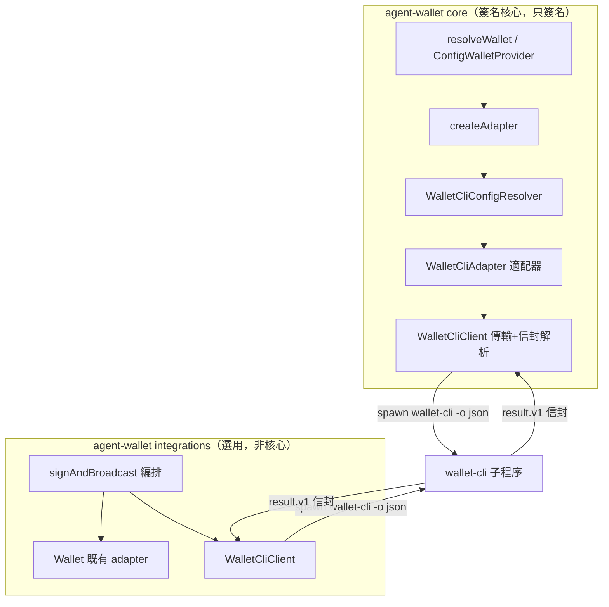
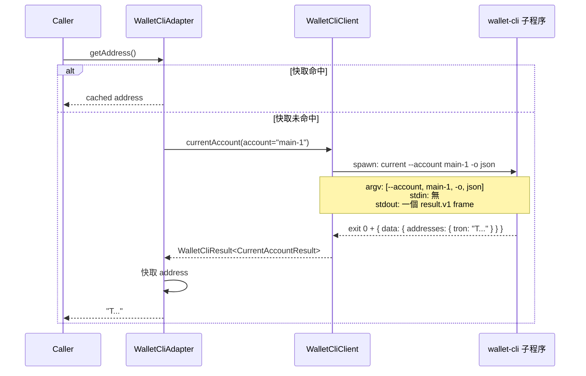
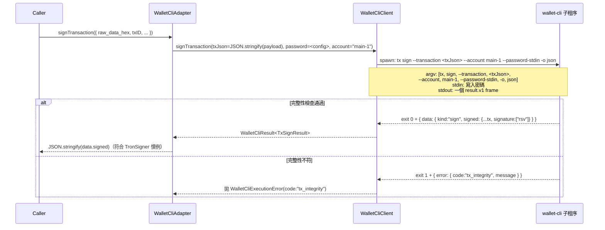
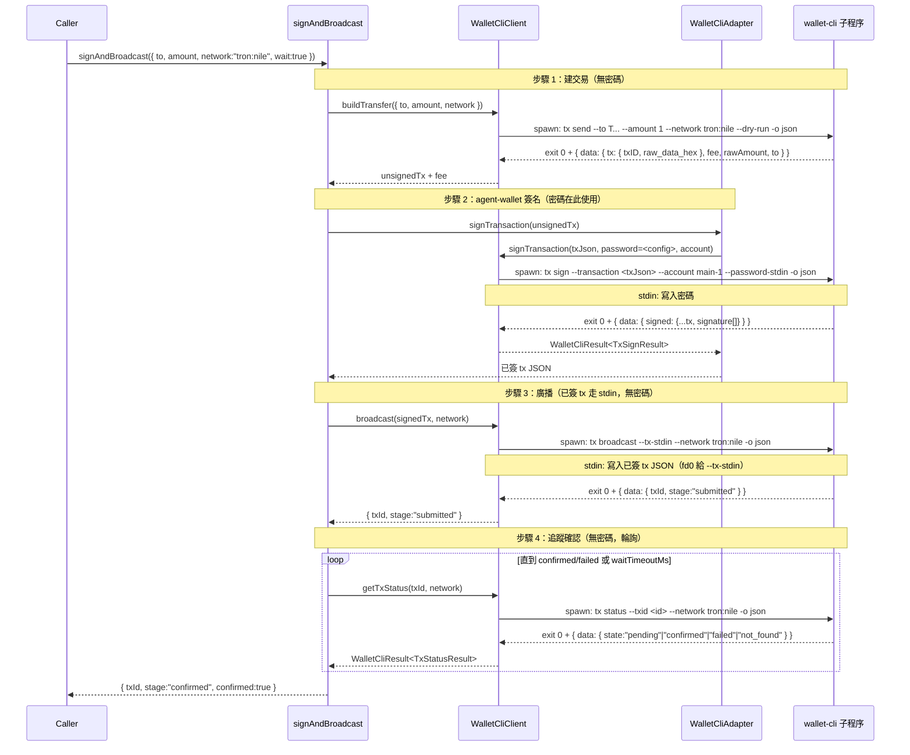

# Design Document — wallet-cli 對接

> **目前實作決策（2026-08-01）**：`local_secure`、自有加密 KV、Python package，以及公開 `Wallet.signRaw` / `Wallet.signMessage` 已移除。wallet-cli adapter 目前提供 `getAddress`、`signTransaction` 與 `signTypedData`。本文後續若出現 `local_secure`、`message sign` 或 `signRaw`，僅保留為早期設計沿革，不代表目前公開契約；現行驗收以 `requirements.md` 為準。

## Overview

本設計讓 agent-wallet 對接 wallet-cli，作為 TRON 外部簽名後端。

wallet-cli 是完整的 TRON 金鑰管理 + 簽名 + 鏈操作工具。agent-wallet 使用其 `tx sign`、`typed-data sign`、`current`、建交易、廣播與查詢能力。

- **TRON 外部簽名**：由 wallet-cli keystore 擁有金鑰、agent-wallet 透過子程序委派簽名。
- **EVM 簽名 / Privy**：由 `raw_secret` 與 `privy` 負責；wallet-cli 目前僅支援 TRON。
- **廣播 / 查詢 / 編排**：作為選用的 `integrations/` 層，復用同一 wallet-cli client。

對接邊界採 wallet-cli 文件保證的穩定機器契約（`wallet-cli.result.v1` JSON 信封 + 退出碼 0/1/2），以**子程序 + JSON 解析**整合，不匯入 wallet-cli 未公開內部、不直接讀其 keystore。

### 密碼模型（關鍵設計決策）

wallet-cli 的 keystore 主密碼是**外部憑證**（用於解鎖 wallet-cli 的 keystore），概念上等同 Privy 的 `app_secret`（用於認證 Privy API）——兩者都是「存取外部簽名後端的憑證」，**都不是 agent-wallet 的主密碼**。因此密碼處理完全沿用 Privy 先例：

- wallet-cli 密碼**直接存於 config params**（`wallets_config.json`，檔案 `0600`），如 `PrivyWalletParams.app_secret`。
- 由 `WalletCliConfigResolver`（鏡像 `PrivyConfigResolver`）從 config source 解析、校驗必填。
- **不**走已移除的 agent-wallet 主密碼或加密 KV；`createAdapter` 的 `wallet_cli` 分支不接收額外主密碼參數。
- 不支援 env 覆寫（與 Privy 一致：`EnvWalletProvider` 僅處理 `raw_secret`）。

> 修正說明：先前設計曾提「單一主密碼慣例」（把 agent-wallet 主密碼同時當 wallet-cli 密碼），此為錯誤——兩者保護不同對象（agent-wallet KV store vs wallet-cli keystore），不應強制相同。改為 config-stored 憑證，與 Privy `app_secret` 一致。

### Goals
- 新增 `wallet_cli` 錢包類型，由 wallet-cli keystore 擁有 TRON 金鑰、agent-wallet 委派簽名。
- `WalletCliAdapter` 實作 `Wallet` + `Eip712Capable`，把 `signTransaction` / `signTypedData` 委派給 wallet-cli 簽名指令，`getAddress` 用 `current`。
- 沿用既有 adapter/provider/config 模式（與 Privy 先例一致）：client 在 `core/clients/`、adapter 在 `core/adapters/`、config resolver 在 `core/providers/`、類型在 `core/config.ts`、`createAdapter` 分派。
- 密碼模型鏡像 Privy `app_secret`：config-stored、resolver 解析、不涉 agent-wallet 主密碼。
- 提供選用編排能力（`integrations/`）：wallet-cli 建交易 → agent-wallet 簽名 → wallet-cli 廣播 → wallet-cli 追蹤。
- 對 wallet-cli 缺失、密碼錯誤、鏈拒絕等提供明確、可分派的錯誤。

### Non-Goals
- 不在 agent-wallet 核心實作交易廣播或 RPC 編排（廣播置於選用 `integrations/`）。
- 不直接讀取 / 解密 wallet-cli 的 keystore 檔案（金鑰由 wallet-cli 擁有）。
- 不匯入 wallet-cli 內部 ports（`Signer` / `Broadcaster`）。
- 不為 wallet-cli 密碼引入 env 覆寫（與 Privy 一致；日後若有需求再評估）。
- 不涵蓋 EVM 廣播或 EVM 本地簽名移轉（wallet-cli 僅 TRON）。
- 不更動 wallet-cli 專案（僅消費其 CLI）。
- `local_secure` 已移除；需要本地明文開發簽名時使用 `raw_secret`，需要外部 TRON keystore 時使用 `wallet_cli`。

### 關鍵假設（flagged）
1. **TRON-only**：`wallet_cli` 類型目前只處理 TRON；EVM 使用 `raw_secret` 或 `privy`。
2. **密碼為 config-stored 憑證（鏡像 app_secret）**：wallet-cli keystore 密碼存於 config params，非 agent-wallet 主密碼。
3. **單一 keystore 擁有者**：TRON 外部 keystore 由 wallet-cli 擁有，agent-wallet 不再維護 `local_secure`。

## Architecture

### 既有架構分析
- `core/adapters/*`：純簽名器。`core/clients/privy.ts`：外部簽名來源的 HTTP 傳輸 client（置於 core 的先例）。
- `core/providers/privy-config.ts`：`PrivyConfigResolver` 從 config source 解析 `app_secret` 等，校驗必填，拋 `PrivyConfigError`。**config-only，無 env。**
- `core/providers/wallet-builder.ts`：`createAdapter` 的 Privy 分支為 `resolver → resolve → client → adapter`，**不使用 `password` 參數**。
- `core/providers/config-provider.ts`：所有目前支援的 config wallet 均自含其解析所需資料，不依賴 agent-wallet 主密碼。
- `core/config.ts`：`WalletConfigSchema`（zod discriminated union by `type` + `params`）。
- steering（`structure.md`）：「Do not mix transaction broadcasting or RPC orchestration into this project; this project signs only.」

### 邊界與分層



- **`core/clients/wallet-cli.ts`**：子程序傳輸 + `wallet-cli.result.v1` zod 校驗 + 退出碼分派。對齊 `PrivyClient` 先例。
- **`core/providers/wallet-cli-config.ts`**：`WalletCliConfigResolver`（鏡像 `PrivyConfigResolver`）從 config params 解析密碼與帳戶。對齊 `privy-config.ts`。
- **`core/adapters/wallet-cli.ts`**：`WalletCliAdapter implements Wallet, Eip712Capable`。僅用 client 的**簽名 / 位址**指令（`tx sign` / `typed-data sign` / `current`），不廣播。→ 核心維持「signs only」。
- **`integrations/wallet-cli/`**：廣播 / 查詢 / 編排。復用同一 client；標示選用、可安全移除、不為 `resolveWallet` 依賴。
- **`core/config.ts`**：擴充 `WalletConfigSchema` 新增 `wallet_cli` 型 + `WalletCliWalletParamsSchema`。

> Steering 處理：簽名 client/adapter/config-resolver 屬 core（與 Privy 一致，皆為「外部簽名來源」）；廣播/查詢在 `integrations/`。建議在 `structure.md` 補述 `integrations/` 層性質。核心契約 `Wallet` 仍只簽名。

### 對接接合點（handoff）

| 階段 | 資料形狀 | 產生者 | 消費者 |
|------|----------|--------|--------|
| 取位址 | `current` → `addresses.tron`（base58） | wallet-cli | `WalletCliAdapter.getAddress` |
| 簽交易 | `tx sign` → `data.signed`（完整已簽 tx，含 `signature[]`） | wallet-cli | `WalletCliAdapter.signTransaction` → `JSON.stringify(data.signed)` |
| 簽 typed-data | `typed-data sign` → `data.signature`（`0x` 前綴） | wallet-cli | adapter 去 `0x` 前綴 |
| 建交易（編排） | `tx send --dry-run` → `data.tx`（未簽）+ `data.fee` | wallet-cli | `Wallet.signTransaction` |
| 廣播（編排） | `tx broadcast --tx-stdin` → `data.txId` + `data.stage` | wallet-cli | caller |
| 確認（編排） | `tx status` → `data.state` 四態 | wallet-cli | caller |

### Technology Stack

| Layer | Choice / Version | Role | Notes |
|-------|------------------|------|-------|
| 子程序傳輸 | Node `child_process.spawn` | 呼叫 `wallet-cli` | 無新相依 |
| 信封解析 | `zod`（既有） | 校驗 `wallet-cli.result.v1` | 與 core 風格一致 |
| stdin 通道 | Node stream | 餵 `--password-stdin`（簽名）/ `--tx-stdin`（廣播） | 單一消費者限制 |
| 執行期相依 | `wallet-cli`（optional peer，Node ≥20） | TRON 簽名 + 鏈操作 | 可選；詳見 Installation & Dependency |

## Component Design

### Part 1 — 核心 TRON 外部簽名後端

#### 1.1 Config 擴充（`core/config.ts`）

```ts
export const WalletCliWalletParamsSchema = z.object({
  account: z.string().optional(),   // wallet-cli 帳戶 label/accountId；省略則用 active account
  password: z.string(),              // wallet-cli keystore 主密碼（config-stored，鏡像 app_secret）
})
// WalletConfigSchema 的 type enum 增 'wallet_cli'；params union 增 WalletCliWalletParamsSchema；refine 補 wallet_cli 分支
export type WalletCliWalletParams = z.infer<typeof WalletCliWalletParamsSchema>
```

#### 1.2 `WalletCliConfigResolver`（`core/providers/wallet-cli-config.ts`）

extends 共享 `ExternalSignerConfigResolver<WalletCliConfig, WalletCliConfigSource>`（見 **Extensibility**）；從 config source 解析、正規化、校驗必填。

```ts
export type WalletCliConfig = {
  account?: string
  password: string
}
export type WalletCliConfigSource = {
  account?: string
  password?: string
}
export class WalletCliConfigResolver extends ExternalSignerConfigResolver<WalletCliConfig, WalletCliConfigSource> {
  resolve(): WalletCliConfig   // 缺 password → 拋 WalletCliConfigError（經基底 required 校驗）
}
```

- `account` 選填（省略則用 wallet-cli active account）。
- `password` 必填；缺失 → `WalletCliConfigError`（基底 `requireFields` 偵測）。
- config-only，不 merge env（與 Privy 一致）；正規化（trim）由基底 `normalizeValue` 提供。

#### 1.3 `WalletCliClient`（`core/clients/wallet-cli.ts`）

職責：子程序呼叫、信封解析、退出碼分派、超時。無狀態、可注入選項。

```ts
interface WalletCliClientOptions {
  binary?: string        // 預設 auto-resolve（見 Installation & Dependency）；可指向絕對路徑或指令名
  timeoutMs?: number     // 預設 60000
  env?: NodeJS.ProcessEnv
}
interface WalletCliResult<T> {
  success: boolean
  command: string
  data?: T
  error?: { code: string; message: string; details?: unknown }
  chain?: { family: string; network: string; chainId: string }
  meta?: { durationMs: number; warnings: string[] }
}
```

方法（簽名/位址相關，供 adapter 用）：
- `currentAccount(accountRef?)` → `wallet-cli current [--account <ref>] -o json`（無密碼）。
- `signTransaction(transactionJson, password, accountRef?)` → `tx sign --transaction <json> --password-stdin`（密碼走 stdin）。
- `signTypedData(typedDataJson, password, accountRef?)` → `typed-data sign --typed-data <json> --password-stdin`。
- 通用 `run(args, stdinPayload?)`：供 `integrations/` 與未來擴充。

**退出碼分派**：
- exit 0 → `success: true`，回 `data`。
- exit 1 → 拋 `WalletCliExecutionError`（帶 `code`：`rpc_error` / `timeout` / `auth_failed` / `watch_only_no_signer` / `signing_rejected` / `tx_integrity` …）。
- exit 2 → 拋 `WalletCliUsageError`（`usage_error` / `missing_option` / `invalid_value` / `weak_password` / `secret_source_error` …）。
- spawn ENOENT → `WalletCliNotFoundError`，提示 `npm i -g @tron-walletcli/wallet-cli`。

#### 1.4 `WalletCliAdapter`（`core/adapters/wallet-cli.ts`）

實作 `Wallet` + `Eip712Capable`，委派簽名給 client。**建構子接收已解析的 `WalletCliConfig`（含密碼）+ `WalletCliClient`**，鏡像 `PrivyAdapter(config, client)`——不接收 agent-wallet 主密碼。

```ts
class WalletCliAdapter implements Wallet, Eip712Capable {
  constructor(config: WalletCliConfig, client: WalletCliClient) {}
}
```

方法對應與正規化：
- `getAddress()` → `client.currentAccount(config.account)` → `data.addresses.tron`；快取結果。不需密碼。
- `signTransaction(payload)` → `client.signTransaction(JSON.stringify(payload), config.password, config.account)` → `JSON.stringify(data.signed)`（符合 agent-wallet 慣例：回已簽 tx JSON 字串）。
- `signTypedData(data)` → `client.signTypedData(JSON.stringify(data), config.password, config.account)` → `data.signature.slice(2)`。

**密碼處理**：
- 密碼來自已解析 config（`params.password`），經 stdin（`--password-stdin`）傳 wallet-cli，**不進 argv/env/日誌**。
- 密碼缺失 → resolver 階段即拋 `WalletCliConfigError`（fail-fast，早於簽名）。
- 密碼錯（wallet-cli `auth_failed`）→ 透傳為 `WalletCliExecutionError`（exit 1）。
- 密碼不符策略（`weak_password`，exit 2）→ `WalletCliUsageError`。

#### 1.5 Provider / 建構接線（`core/providers/wallet-builder.ts`）

`WalletType` 增 `WALLET_CLI: 'wallet_cli'`。外部簽名器改採**註冊表**分派（見 **Extensibility**），`wallet_cli` 自行註冊 builder，`createAdapter` 不再逐型 if-else：

```ts
// wallet-cli 模組自行註冊（import 時生效）
registerExternalSigner('wallet_cli', (params, _ctx) => {
  const resolved = new WalletCliConfigResolver({ source: params as WalletCliWalletParams }).resolve()
  return new WalletCliAdapter(resolved, new WalletCliClient())
})

// createAdapter 內：外部簽名器走註冊表
const builder = externalSignerRegistry.get(conf.type)
if (builder) return builder(conf.params, { network })
```

→ `ConfigWalletProvider` / `resolveWallet` 自動套用；`raw_secret` 維持既有 if-else，外部簽名器走註冊表。

#### 1.6 匯出（`src/index.ts`）

```ts
export { WalletCliAdapter } from './core/adapters/wallet-cli.js'
export { WalletCliClient } from './core/clients/wallet-cli.js'
export { WalletCliConfigResolver } from './core/providers/wallet-cli-config.js'
export type { WalletCliWalletParams, WalletCliConfig } from '...'
export type { WalletCliClientOptions, WalletCliResult } from '...'
export { WalletCliConfigError, WalletCliNotFoundError, WalletCliUsageError, WalletCliExecutionError } from '...'
```

### Part 2 — 選用鏈操作編排（`integrations/wallet-cli/`）

非核心、可安全移除。復用 `WalletCliClient` 的通用 `run`，外加廣播/查詢方法。

#### 2.1 廣播 / 查詢方法
- `buildTransfer(opts)` → `tx send --dry-run`：未簽 tx + fee 估算（不需密碼）。
- `broadcast(signedTx)` → `tx broadcast --tx-stdin`：已簽 tx JSON 走 stdin（不需密碼）。
- `getTxStatus(txid)` → `tx status`：四態。
- `getBalance(address?)` → `account balance`。
- `getTxInfo(txid)` → `tx info`。

#### 2.2 `signAndBroadcast` 編排助手
串接：建交易 → agent-wallet 簽名 → 廣播 → （可選）追蹤。純函式，注入 `Wallet` 與 `WalletCliClient`。

```ts
interface SignAndBroadcastParams {
  to: string
  amount?: string | rawAmount?: string   // 人類單位 / SUN（互斥）
  token?: string | contract?: string | assetId?: string
  network: string              // 必填
  wait?: boolean
  waitTimeoutMs?: number
}
```

流程：
1. `client.buildTransfer(...)` → 未簽 tx（`txID`/`raw_data_hex`）。
2. `wallet.signTransaction(unsignedTx)` → 已簽 tx JSON（**agent-wallet 核心簽名**；若 `wallet` 為 `WalletCliAdapter`，則再委派 wallet-cli `tx sign`——密碼在此環節由 adapter 內部使用）。
3. `client.broadcast(JSON.parse(signedTxJson))` → `txId`。
4. `wait` 為真則輪詢 `client.getTxStatus(txId)` 至 `confirmed`/`failed`。
5. 回傳 `{ txId, stage, confirmed?, failed? }`。

> 關鍵：**密碼只在 adapter 內部使用**（經 `--password-stdin` 傳 wallet-cli）；wallet-cli 建交易（`--dry-run`）與廣播（已簽 tx）皆不需密碼。


## Extensibility — 新增外部錢包

本設計預期後續新增更多外部簽名器（其他 WaaS、硬體錢包、其他 CLI）。為避免每新增一個即重複一份樣板、並使 `createAdapter` 的 if-else 持續膨脹，引入三項共享抽象（皆為既有 Privy 先例的提取，非新發明）。

### 共享錯誤階層（`core/errors.ts`）

外部簽名器共用一組錯誤基底，使呼叫端能以類別（而非逐一列舉）捕捉：

```
WalletError
├── ExternalSignerError            外部簽名器基底
│   ├── ExternalSignerConfigError      config 解析/必填校驗失敗
│   ├── ExternalSignerExecutionError   執行失敗（auth_failed / rpc_error / timeout …）
│   ├── ExternalSignerUsageError       呼叫端錯誤（壞旗標，重試無益）
│   └── ExternalSignerNotFoundError    後端不可用（binary 不在 PATH 等）
├── SigningError / NetworkError / …    既有，不變
```

- 新增外部錢包用此階層，不再每型各造 `XxxConfigError`。
- **Privy 回填（低風險、加法性）**：`PrivyConfigError` / `PrivyRequestError` / `PrivyAuthError` / `PrivyRateLimitError` 改 extend 對應共享基底。經查全庫 `instanceof` 僅檢查 `WalletError`（`delivery/cli.ts`），插入中間層後 `instanceof WalletError` 與 `instanceof Privy*` 皆保留，故向後相容。回填為建議性後續，不阻塞本期。

### 共享 config resolver 基底（`core/providers/external-signer-config.ts`）

`PrivyConfigResolver` 與 `WalletCliConfigResolver` 的「config-only、正規化(trim)、必填校驗、拋 ConfigError」邏輯一致，提取為泛型基底：

```ts
abstract class ExternalSignerConfigResolver<TConfig, TSource> {
  constructor(opts: { source?: TSource }) {}
  abstract resolve(): TConfig
  protected normalizeValue(v: string | undefined): string | undefined   // trim
  protected requireFields(merged: TSource, required: string[]): string[] // 偵測缺失
}
```

新外部錢包的 resolver extend 此基底，僅宣告自己的欄位與必填集。

### 註冊表分派（`core/providers/wallet-builder.ts`）

外部簽名器改註冊制，新增型別不必編輯 `createAdapter` 主幹：

```ts
type ExternalSignerBuilder = (params: unknown, ctx: { network?: string }) => Wallet
const externalSignerRegistry = new Map<string, ExternalSignerBuilder>()
function registerExternalSigner(type: string, builder: ExternalSignerBuilder): void
```

`createAdapter` 對外部型走 `externalSignerRegistry.get(conf.type)`；`raw_secret` 維持 if-else。config schema（zod union）仍需登錄新型的 params schema，以維持型別安全。

### 新增外部錢包的步驟（擴充配方）

1. `core/base.ts` + `core/config.ts`：`WalletType` enum 新增值（base.ts）、params schema 加入 union、refine 補新型分支（config.ts）。
2. `core/providers/external-signer-config.ts`：宣告 resolver（extend 共享基底，定義欄位/必填）。
3. `core/clients/<name>.ts`：實作傳輸 client（HTTP / 子程序 / 其他）。
4. `core/adapters/<name>.ts`：實作 `Wallet`（+ `Eip712Capable`），委派給 client，做簽名格式正規化。
5. `core/errors.ts`：錯誤 extend 共享 `ExternalSigner*` 基底（不再各造基底）。
6. `core/providers/wallet-builder.ts`：`registerExternalSigner('<type>', builder)`。
7. `src/index.ts`：匯出。

> 取捨：不引入完全動態的 plugin 系統（如單一 `external` 型 + dispatch）——那會犧牲 zod discriminated union 的編譯期型別安全，且各外部簽名器的 params 形狀確實不同。註冊表 + 共享基底在「集中分派/複用」與「保留型別安全」間取得平衡。

## Installation & Dependency

agent-wallet 以**子程序**呼叫 wallet-cli（非程式碼 import），故相依關係是「執行期需有 `wallet-cli` binary 可用」，而非 bundle 依賴。據此選定相依模型與安裝流程。

### 相依模型：optional peer dependency（非硬依賴）

在 agent-wallet `package.json` 宣告：

```json
{
  "peerDependencies": {
    "@tron-walletcli/wallet-cli": ">=0.1.1"
  },
  "peerDependenciesMeta": {
    "@tron-walletcli/wallet-cli": { "optional": true }
  }
}
```

**為何不列為 `dependencies`（硬依賴）**：

| 顧慮 | 硬依賴的問題 | optional peer 的處理 |
|------|------------|---------------------|
| Node 版本 | wallet-cli 需 Node ≥20，agent-wallet 承諾 ≥18；硬依賴變相把所有使用者的 Node 下限抬到 20 | 僅 `wallet_cli` 類型使用者需 ≥20；EVM/Privy 使用者不受影響 |
| 安裝足跡 | wallet-cli 帶 Ledger HW、tronweb、axios、yargs 等重依賴，會被強裝到所有 agent-wallet 使用者（含純 EVM/Privy） | 僅需要者安裝 |
| 授權 | wallet-cli 為 LGPL-3.0，agent-wallet 為 MIT；硬依賴把 LGPL 拉入所有使用者的依賴樹 | 可選，使用者自行選擇引入 |
| 耦合/穩定 | wallet-cli 仍 v0.1.1（pre-1.0，可能變動）；硬釘易碎 | peer 範圍 `>=0.1.1`，使用者可控升級 |
| 概念 | wallet-cli 是「外部簽名後端」（自有 keystore、子程序驅動），非程式庫 | peer 如實建模「agent-wallet 可用 wallet-cli，若你提供」 |

### Binary 解析順序（runtime，`WalletCliClient` 首次呼叫時延遲解析）

1. 顯式 `WalletCliClientOptions.binary`（絕對路徑或指令名）——CI/進階使用者。
2. 環境變數 `AGENT_WALLET_WALLET_CLI_PATH`——覆寫 binary 路徑（支援本地安裝未上 PATH 的場景）。
3. `wallet-cli` on PATH——全域安裝的預設路徑。
4. 皆無 → 拋 `WalletCliNotFoundError`，訊息含安裝指令 `npm i -g @tron-walletcli/wallet-cli`。

> 不做 `node_modules/.bin` 硬編碼路徑猜測（脆弱且跨套件管理器不一）；本地安裝者用環境變數或顯式 `binary` 覆寫。

### Node 版本守衛

`WalletCliClient` 首次呼叫時檢查 `process.version`：若 < 20 且 binary 解析失敗或子程序回報 Node 錯誤，拋明確錯誤「wallet-cli requires Node.js ≥20; current runtime is Node X」（proactive，避免使用者陷入模糊的 Node 報錯）。此守衛只影響 `wallet_cli` 路徑，不改 agent-wallet 整體 `engines`（維持 ≥18）。

### 安裝流程（依使用者類型）

**A. SDK 使用者（`npm install @bankofai/agent-wallet`，需要 TRON）**
```bash
npm install @bankofai/agent-wallet
npm install @tron-walletcli/wallet-cli          # 本地裝；設 AGENT_WALLET_WALLET_CLI_PATH 或用全域
# 或全域：
npm install -g @tron-walletcli/wallet-cli       # 上 PATH，無需環境變數
```
- 先用 wallet-cli `create`/`import` 建立金鑰與帳戶。
- 於 agent-wallet config 加 `wallet_cli` 條目（`account` + `password`）。

**B. agent-wallet CLI 全域使用者（`npm install -g @bankofai/agent-wallet`）**
```bash
npm install -g @bankofai/agent-wallet
npm install -g @tron-walletcli/wallet-cli       # 兩者皆全域，PATH 可見
```

**C. 開發 / CI（agent-wallet repo）**
- 將 `@tron-walletcli/wallet-cli` 列為 `devDependency`（供整合測試用真實 binary），或 CI 預裝全域。
- 整合測試對 `tron:nile`，標記為可跳過（離線/無 CI binary 時）。

### 降級語意

`wallet_cli` 錢包類型為**可選能力**：未安裝 wallet-cli 時，agent-wallet 其餘功能（EVM 簽名、Privy、`raw_secret`）完全不受影響。建立或使用 `wallet_cli` 條目時才需 binary 可用。

## System Flows

以下時序圖標示每次子程序呼叫的 argv / stdin / stdout / 退出碼，為實作期精確依據。密碼一律來自已解析的 `WalletCliConfig`（config-stored，鏡像 Privy `app_secret`）。

### 流程 A：取得位址（`getAddress`，無密碼）

最簡呼叫，確立子程序基線模式。`current` 為本地 metadata 指令，不需密碼、不需網路。



### 流程 C：簽交易（`signTransaction`，payload 走 argv）

與流程 B 同模式，差別在 payload 為未簽 TRON 交易 JSON（較大但非機密，走 argv），回傳完整已簽 tx 物件。wallet-cli `tx sign` 會做完整性檢查（`txID` = sha256(`raw_data_hex`)），不符則 exit 1 + `tx_integrity`。



### 流程 D：端到端簽名 + 廣播（`signAndBroadcast`，密碼僅在第 2 步）

編排流程展示「密碼只在簽名環節」：建交易（`--dry-run`，無密碼）→ agent-wallet 簽名（密碼在此用）→ 廣播（已簽 tx，無密碼）→ 追蹤（無密碼）。已簽 tx JSON 經 stdin（`--tx-stdin`）傳遞，因廣播不帶 `--password-stdin`，fd0 空出可吃 `--tx-stdin`。



### 退出碼分派匯整（所有流程共用）

```
exit 0            → success:true, 回傳 data
exit 1            → WalletCliExecutionError（code: auth_failed | rpc_error | timeout | tx_integrity | signing_rejected | watch_only_no_signer | internal_error …）
  └─ timeout      → 交易可能仍在飛；編排不自動重送，回「以 tx status 複核」
exit 2            → WalletCliUsageError（code: usage_error | missing_option | invalid_value | weak_password | secret_source_error …；呼叫端壞掉，重試無益）
spawn ENOENT      → WalletCliNotFoundError（提示 npm i -g @tron-walletcli/wallet-cli）
```

## Data Models / Contracts

### `wallet-cli.result.v1` 信封（zod）
```ts
const ResultEnvelopeSchema = z.object({
  schema: z.literal('wallet-cli.result.v1'),
  success: z.boolean(),
  command: z.string(),
  data: z.unknown().optional(),
  error: z.object({ code: z.string(), message: z.string(), details: z.unknown().optional() }).optional(),
  meta: z.object({ durationMs: z.number(), warnings: z.array(z.string()) }).optional(),
  chain: z.object({ family: z.string(), network: z.string(), chainId: z.string() }).optional(),
})
```

### 命令資料模型（型別化介面）
- `CurrentAccountResult`：`{ accountId, label, type, index, active, addresses: { tron }, seedId? }`
- `TxSignResult`：`{ kind: 'sign', mode: 'sign-only', address, txId, signed: { ...tx, signature: string[] } }`
- `TypedDataSignResult`：`{ address, primaryType, digest, signature }`（signature `0x` 前綴）
- `BuildTransferResult`：`{ kind, mode: 'dry-run', tx: UnsignedTx, fee, rawAmount, to }`
- `BroadcastResult`：`{ kind: 'broadcast', stage, txId, confirmed?, failed?, blockNumber? }`
- `TxStatusResult`：`{ state, confirmed, failed }`
- `AccountBalanceResult`：`{ address, balance, decimals, symbol }`

### `wallets_config.json` 範例（`wallet_cli` 類型，密碼存於 params，鏡像 privy 的 app_secret）
```json
{
  "active_wallet": "tron_main",
  "wallets": {
    "tron_main": {
      "type": "wallet_cli",
      "params": { "account": "main-1", "password": "Abc12345!@" }
    },
    "default_privy": {
      "type": "privy",
      "params": { "app_id": "...", "app_secret": "...", "wallet_id": "..." }
    }
  }
}
```

### 一致性與完整性
- 金額一律以十進位**字串**處理，絕不轉 JS number。
- 簽名格式正規化集中於 adapter（去 `0x` 前綴 / JSON.stringify 已簽 tx），對呼叫端透明，與既有 `TronSigner` 輸出慣例一致。
- 金鑰單一擁有者：wallet-cli keystore；agent-wallet 不解密、不重簽。
- 密碼為 config-stored 憑證（非 agent-wallet 主密碼），與 Privy `app_secret` 同一姿態。

## Error Handling

- **fail-fast**：binary 缺失、密碼缺失（resolver 階段）、旗標互斥 → 立即明確錯誤。
- **退出碼先行**：先判 exit-code 類別（usage/execution/not-found），再選擇性看 `code`。
- **錯誤碼開放非窮舉**：與 wallet-cli 一致；容忍未知 code 回退到所屬 exit-code 類別。
- **timeout 語意**：exit 1 + `timeout` 時交易可能仍在飛→編排助手不自動重送，回傳「以 `tx status` 複核」狀態，由 caller 決策。
- **機密**：錯誤訊息與日誌不 echo 密碼；wallet-cli 本即把未預期例外 redact 為 `internal_error`。
- **觀測**：記錄 command、exit code、`error.code`、`durationMs`；不記錄密碼或簽名明文以外的敏感值。

錯誤類別沿用既有 `WalletError` 風格，並為「外部簽名器」引入共享基底（見 **Extensibility**）。wallet-cli 專屬錯誤：
- `WalletCliConfigError extends ExternalSignerConfigError`：config 解析失敗（缺密碼等）。
- `WalletCliExecutionError extends ExternalSignerExecutionError`：exit 1，帶 `code`。
- `WalletCliUsageError extends ExternalSignerUsageError`：exit 2。
- `WalletCliNotFoundError extends ExternalSignerNotFoundError`：binary 不在 PATH。

## 演進與遷移

- **目前**：支援 `raw_secret` / `privy` / `wallet_cli`；`local_secure` 已移除。使用者可將 TRON 錢包以 `wallet_cli` 配置（金鑰在 wallet-cli keystore，密碼可直接存於 config 或由 exec script 解析）。
- **遷移建議**：以 wallet-cli `create`/`import` 建立金鑰 → 於 agent-wallet config 加 `wallet_cli` 條目（`account` + `password`）。

## CLI Support（選用，後續階段）

本設計聚焦 client/adapter/編排層。是否在 agent-wallet CLI 暴露 `wallet_cli` 建檔或編排指令屬後續可選項，**不在本次設計強制範圍**。若實作：偵測 wallet-cli 是否在 PATH；mainnet 操作需互動確認；不引入新本地密鑰儲存；密碼寫入 config params 時遵循 `0600` 與 redaction（與 Privy `app_secret` 一致）。

## Testing Strategy

- **單元**：
  - `WalletCliConfigResolver`：校驗密碼必填（缺失拋 `WalletCliConfigError`）、`account` 選填、正規化（鏡像 `PrivyConfigResolver` 測試）。
  - `WalletCliClient`：stub `spawn` 模擬 exit 0/1/2 與 ENOENT，驗證信封解析與錯誤分派；stdin 餵密碼/tx 的串流行為。
  - zod 信封校驗：合法/缺欄/未知 schema fixture。
  - `WalletCliAdapter`：mock client，驗證 `getAddress` 快取、`signTransaction` 回 `JSON.stringify(data.signed)`、`signTypedData` 去 `0x`、密碼經 stdin 傳遞。
  - `createAdapter`：`wallet_cli` 分支正確建構 adapter（不使用 `password` 參數）；config schema 校驗 `wallet_cli` 條目。
- **整合（可跳過的網路測試）**：以真實 wallet-cli binary（CI 預裝）對 `tron:nile`：`current` 取位址（無密碼）→ `typed-data sign`（密碼走 stdin）→ 驗證簽名。
- **編排**：mock `Wallet` + mock `WalletCliClient`，驗證 `signAndBroadcast` 的建→簽→廣→追蹤順序與分支（confirmed/failed/timeout）。
- **跨平台**：子程序啟動、stdin 串流、PATH 解析在 macOS/Linux 明確測試。
- **Post-Change 驗證**（依 steering）：`pnpm test`、`pnpm lint`、`pnpm build` 需通過。

## Security Considerations

- **金鑰隔離**：金鑰只在 wallet-cli keystore；agent-wallet 不解密、不持有明文私鑰。
- **密碼為 config 憑證（鏡像 app_secret）**：wallet-cli keystore 密碼存於 `wallets_config.json` params（`0600`）或透過 exec script 解析，與 Privy `app_secret` 同一姿態。
- **密碼傳遞**：密碼只在 adapter 內部經 stdin（`--password-stdin`）傳 wallet-cli，**不進 argv/env/日誌**；廣播/建交易不需密碼。
- **不經 argv/env 傳機密**：已簽 tx 經 stdin（`--tx-stdin`）；payload（交易/typed-data/message）非機密，走 argv（對齊 wallet-cli 規範）。
- **mainnet 防護**：編排助手在 `tron:mainnet` 動真錢時要求顯式確認旗標；預設測試用 `tron:nile`。
- **信任邊界**：wallet-cli 為外部程序；其 stderr/未預期輸出視為不可信資料，不解析為指令；錯誤 redact 由 wallet-cli 處理。
- **config 機密姿態**：密碼存於 config 明文，與 `app_secret` / `raw_secret.private_key` 一致；config 檔 `0600`。`inspect` 類輸出須 redact 密碼（與 Privy 對 app_secret 的 redaction 一致）。

## Performance & Scalability

- 子程序往返成本可接受；`WalletCliClient` 無狀態。
- `getAddress` 結果於 adapter 內快取，避免重複 `current` 呼叫。
- 廣播/查詢結果由 caller 快取（client 本身不快取，避免跨網路污染）。

## Requirements Traceability

> 本 spec 處於 design 階段，`requirements.md` 尚未產生。下表為設計對應的高階需求意向，待需求階段正式化。

| 意向需求 | 涉及元件 | 介面 / 流程 |
|----------|----------|-------------|
| wallet-cli 持有 TRON 金鑰並提供簽名 | `WalletCliAdapter` + `WalletCliClient` | Part 1.3/1.4 |
| 密碼為 config-stored 憑證（鏡像 app_secret） | `WalletCliConfigResolver` + config params | Part 1.1/1.2 |
| `wallet_cli` 成為可配置錢包類型 | `core/config.ts` + `createAdapter` | Part 1.1/1.5 |
| 既有 resolver/provider 自動套用、無需主密碼 | 不改 `resolveWallet` / `walletIsAvailableWithoutPassword` | Part 1.5 |
| 透過 wallet-cli 建未簽交易 + 估手續費 | `buildTransfer` | Part 2 |
| 透過 wallet-cli 廣播已簽交易 | `broadcast` | Part 2 |
| 追蹤確認狀態 | `getTxStatus` | Part 2 |
| 查詢餘額 | `getBalance` | Part 2 |
| 優雅處理 wallet-cli 缺失/密碼錯/鏈失敗 | error 模型 | Error Handling |

## Supporting References

- `archive/research.md`：整合前研究紀錄，已凍結。
- `archive/design-options.md`：早期方案比較，已凍結。
- wallet-cli：`ts/docs/machine-interface.md`、`ts/docs/commands/{tx/sign,tx/broadcast,tx/send,tx/status,message/sign,typed-data/sign,current,create,account/info,account/balance}.md`、`ts/docs/concepts/security.md`、`ts/skills/wallet-cli/SKILL.md`。
- agent-wallet：`packages/typescript/src/core/adapters/{tron,privy}.ts`、`core/clients/privy.ts`、`core/providers/{privy-config,config-provider,wallet-builder}.ts`、`core/config.ts`、`core/resolver.ts`、`.kiro/steering/structure.md`。
